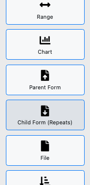
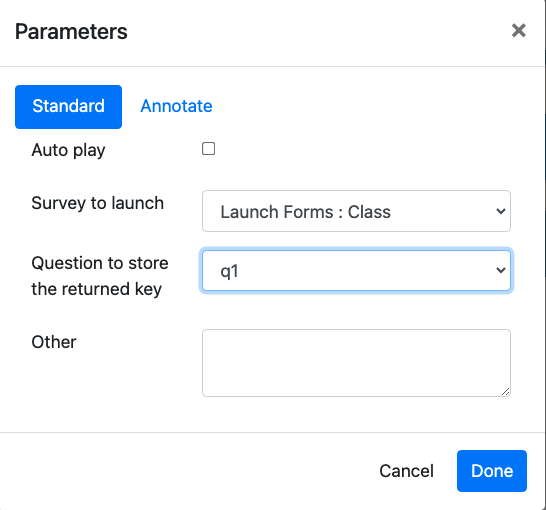
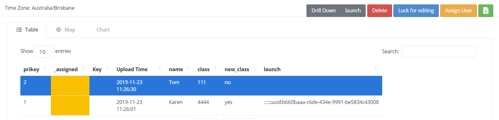
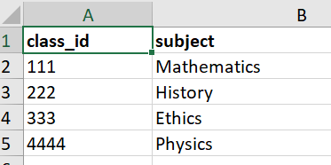
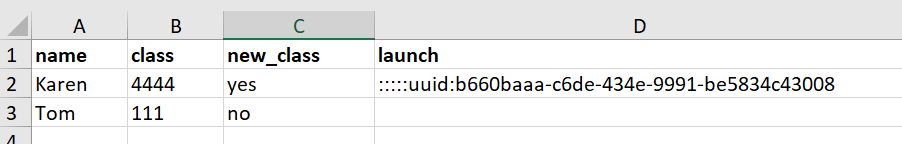

Launch a Survey from inside a Survey
====================================

While completing a survey you may find that another survey also needs to be completed.  You can launch this second survey from 
within the survey you are currently filling in, complete it, and then be
returned automatically to your location in the first survey.  

There are many applications for this feature. You could create a survey whose sole purpose was to 
decide which survey really needs to be completed.

.. note::

  This capability is similar to entering a subform using **begin repeat** (:ref:`xls-repeats`).  However sub forms are included within the main 
  survey whereas here we are starting a completely different survey.

Linking data between the surveys
--------------------------------

When you launch another survey you may want to be able to connect the data between the launched survey and the survey that is doing the 
launching.  This is done by specifying a question in one of the surveys that will hold a key pointing to a record in the second survey.

.. note::

  If you specify a question to hold a linking key then the relationship between the two forms is one to many.  That is a single record in one of
  the surveys can be referenced by many records in the second.  The question is which survey has the single record and which has the many?  This leads
  to the concept of a **parent** survey and a **child** survey.  The parent can have many children but in this world of surveys a 
  child can have only one parent.

  When launching a new survey you can choose that it be a child or a parent of the current survey.  If you are not linking the data between the
  surveys then it does not matter which one you choose.  
  
  the following examples are going to be based on the **parent** survey being a class in a school and the **child** survey being a pupil 
  in that school.

Example 1 - Launch the Class Survey(Parent) from a Pupil Survey (Child)
+++++++++++++++++++++++++++++++++++++++++++++++++++++++++++++++++++++++

Lets assume you are completing a survey to get details on a pupil and you want to note the class that they are attending.  However that class is not
currently available to be picked.  Hence the class survey is launched as a **parent form/survey** and you specify that the key created by the 
class survey should be stored in the **class** question of the **Pupil survey**.

The :ref:`online-editor` offers good support for launching surveys.  So first create the Pupil survey using the online editor 
then add a Parent Survey question type.

   Select the Parent Survey / Form Question Type

You will then be asked to add parameters.

   Set the parameters
   
#.  Select the survey to launch, in this example its the **class** survey
#.  Select the question in the child survey in which to store the key. Optional, but since we want to link the pupil to the class 
    we are going to do this.  This question has to accept an answer that is of type text.  As well as text questions, select_one,
    calculates, barcodes all store their data as text.	The online editor will present the valid questions that you can select. 
#.  Select Auto Play if you want the class survey to be launched without the user having to press a button.

Launch a Child Survey
+++++++++++++++++++++

Alterntively you may be completing a survey on classes and realise that you have not registered a child that you want to enroll in the class.
Follow the same steps as for creating the parent survey but this time select the **child survey / form** question type.   When you are asked
where you want to place the key, the questions shown will be from the child survey. 

Making use of linkages between Surveys
++++++++++++++++++++++++++++++++++++++

If you are analysing your data in a Business Intelligence tool then you can join the data using the key question.  Alternatively in the console
you can **drill down** from parent survey to child survey or from child survey up to parent survey to see the connected data.

Other Considerations
--------------------

Commonly you will not want the user to start up a "launched" survey independently.  You can hide launched surveys 
so that they are not directly visible in fieldTask.  To do this go to the survey settings and select "Hide on device".

Tutorial - Launching a Child Survey
-----------------------------------

1. First create a survey called "Class". Add some questions including a text question called class_id.  Edit the keys for this survey
and set the key to "${class_id}".

2. Using the online editor create a survey called "Pupil".  Add some questions that you might want to record about the pupil such as their
name.

3. Now in the Pupil form we are going to select the class attended by the pupil.  Add a question called "class" of type select_one and specify that it
get its choice list from the **Class** form.  This is great, if there is an existing class the Pupil can be assigned to it.  However if there is
not an existing class then we want to launch a survey to create that task and automatically assign our pupil to it.

.. note::

  The online editor will guide you through getting a choice list from another survey.  To do this edit the appearance for the select question
  and select the **search** tab.
  
4. Create a question of type select_one with a label "Is a new class needed?".  

5. Add a question of type "parent_form".  Make it relevant only if a new class is needed. Edit the parameters
to specify:

*  Survey to launch:  Set to "Class"
*  Question to store the returned key: Set this to the question in the Pupil form also called "class".

Sample surveys as described above can be downloaded from:

*  `Finished class survey <https://docs.google.com/spreadsheets/d/1oh6oH9dM3-Kvs1-mN-J2GbOEBI19byId-d_YxXBFHU8/edit?usp=sharing>`_
*  `Finished pupil survey <https://docs.google.com/spreadsheets/d/1skiRy3WimY-rPZM8msjTZV93l-qmbxv8Sf7Wn-n4PuU/edit?usp=sharing>`_

Testing
+++++++

*  Complete the **Class** survey a couple of times to add some classes.
*  Complete the **Pupil** survey and select an existing task.
*  Complete the **Pupil** survey and specify that a new class is needed.  Add a new class from within the **Pupil** survey.
*  Using the console drill down from each pupil to see details on the class that they are enrolled in.  This should work for
   all of the Pupils even those for whom a class was created at the same time as the pupil.
   

   
   Drilling down to get the class details
   
*  Export the data collected for each survey into a spreadsheet.  You should see that the **class** question in the **Pupil**
   survey holds the **class_id** for all pupils.  Using spreadsheets this data would be difficult to combine however if you used
   a business intelligence tool you would be able to join the data from the two surveys using the class_id questions.
   

   Class Data
   

   Pupil Data
   
.. note::

  The Pupil data contains a value for the question that launched the class form. This question was called "launch" in the 
  example survey.  The value in this question is used by the Smap system during the linking of
  of the data in the two surveys and it can be ignored for analysis.