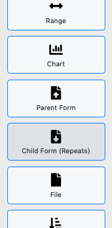
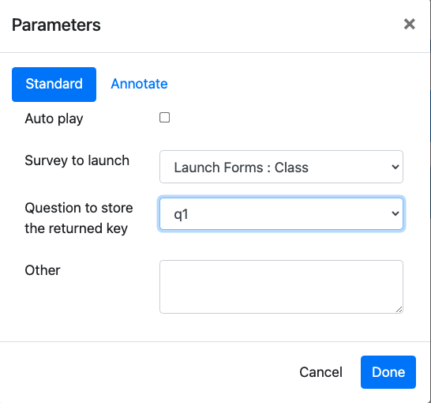

.. _launch-survey:

Launch a Survey from inside a Survey
====================================

.. contents::
  :local:

While completing a survey you may find that another survey also needs to be completed. You can launch this second survey from
within the first, complete it, and then be returned automatically to your location in that first survey.

.. note::

  This capability is similar to entering a subform using **begin repeat** (:ref:`xls-repeats`). However sub forms are included within the main
  survey whereas here we are starting a completely different survey.

Use cases
---------

* Create a survey whose sole purpose is to decide which survey needs to be completed.  In this case you can use either the "Parent Form"
  or the "Child Form" and the **type** of the question that will launch the survey.  These types are only important when you want to link
  data between the two surveys for analysis.
* Launch a form to enter details on an item that is referenced by your current form.  For example you to record details of a meeting and in
  that meeting launch a separate "action items" survey to record details on each action item.  In your analysis dashboard you will still want
  to view action items grouped by meeting as well as viewing details on all the action items so they need to be linked.

Linking data between the surveys
--------------------------------

When you launch another survey you may want to be able to connect the data between the two surveys.
This is done by specifying a question in one of the surveys that will hold a key pointing to a record in the other.

.. note::

  If you specify a question to hold a linking key then the relationship between the two surveys is one to many. That is a single record in one of
  the surveys can be referenced by many records in the other. The question is: which survey has the single record and which has the many? This leads
  to the concept of a **parent** survey and a **child** survey. The parent can have many children but, in this world of surveys, a
  child can have only one parent.

  When launching a new survey you can choose that it be a child or a parent of the first survey. If you are not linking the data between the
  surveys then it does not matter which one you choose.

  The following examples are going to be based on the **parent** survey being a class in a school and the **child** survey being a pupil
  in that school.

Example 1 - Launch the Class Survey (Parent) from a Pupil Survey (Child)
+++++++++++++++++++++++++++++++++++++++++++++++++++++++++++++++++++++++++

Let's assume you are completing a survey to get details on a pupil and you want to note the class that they are attending. However that class is not
currently available to be picked. Hence the class survey is launched as a **parent form/survey** and you specify that the key created by the
class survey should be stored in the **class** question of the **Pupil survey**.

The :ref:`online-editor` offers good support for launching surveys. So first create the Pupil survey using the online editor
then add a Parent Survey question type.

   Select the Parent Survey / Form Question Type

You will then be asked to add parameters.

   Set the parameters

#.  Select the survey to launch, in this example it's the **class** survey.
#.  Select the question in the child survey in which to store the key. Optional, but since we want to link the pupil to the class
    we are going to do this. This question has to accept an answer that is of type text. As well as text questions, select_one,
    calculates, barcodes all store their data as text. The online editor will present the valid questions that you can select.
#.  Select Auto Play if you want the class survey to be launched without the user having to press a button.

Example 2 - Launch a Child Survey
+++++++++++++++++++++++++++++++++

Alternatively you may be completing a survey on classes and realise that you have not registered a child that you want to enroll in the class.
Follow the same steps as for creating the parent survey but this time select the **child survey / form** question type. When you are asked
where you want to place the key, the questions shown will be from the child survey.

Making use of linkages between Surveys
++++++++++++++++++++++++++++++++++++++

If you are analysing your data in a Business Intelligence tool then you can join the data using the key question. Alternatively in the console
you can **drill down** from parent survey to child survey or from child survey up to parent survey to see the connected data.

Hiding the launched Surveys on the phone
----------------------------------------

Commonly you will not want the user to start up a "launched" survey independently. You can hide launched surveys
so that they are not directly visible in FieldTask. To do this go to the survey settings and select "Hide on device".

Passing data to the launched survey
-----------------------------------

Initial Data
++++++++++++

Available with Smap Server 20.09+

You can specify the initial data that the launched survey receives in the "initial" parameter. For example::

  initial=name:${qname},vegetable:parsnip

The format is 1 or more comma separated value specifications consisting of:

* The name of the question in the launched form that is going to receive the default value
* A colon separator
* The value

This value can be static like "parsnip" in the above example or by using the ${} notation you can specify that the value can be taken from the
launching form. In the above example the question called "name" in the launched survey will get its initial value from the question called
"qname".

.. note::

  When getting initial data from the launching form you can only refer to data in its top level form. That is not within a repeating group.

Update an existing Record
+++++++++++++++++++++++++

Available with Smap Server 24.01+. Only available with Web Forms.

You can specify the instance of the record to be updated as a parameter called "instance"::

  instance=${instance_to_update}

You can pass initial data, as described above, which will override the data pulled from the instance.

`Video showing how to edit an existing record from webforms <https://youtu.be/1POwyhSK5BI>`_

Tutorial - Launching a Parent Survey
------------------------------------

See :ref:`launch-survey-tutorial` for a step-by-step example.
