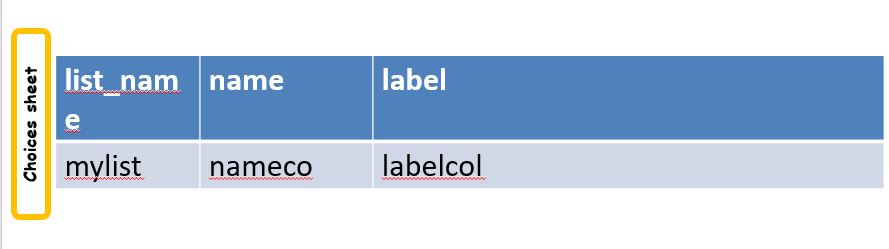
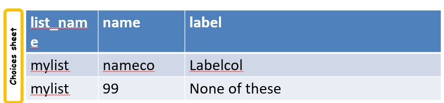

.. _looking-up-data:

Looking up Data
===============

.. contents::
 :local:

Sources
-------

Data can be sourced from:

*  CSV Files
*  Surveys

In the remainder of this document the source of the data will be written as *SOURCE*.  Replace this with the name of the CSV file or the 
identifier of the survey that contains your data.

Using CSV Files
+++++++++++++++

Creating the file
%%%%%%%%%%%%%%%%%

The first row of the CSV file contains the header. Use the same rules for specifying column headers as are used for question names,
that is english characters and underscores with no spaces.  

Subsequent rows contain the data.  These can contain any characters supported by your phones using Unicode.

.. warning::

  The name of the CSV file should not have any spaces.

Loading a CSV file onto the Server
%%%%%%%%%%%%%%%%%%%%%%%%%%%%%%%%%%

If your CSV file might be used by more than one survey then you should load it on to the server as a shared resource.

*  Select the *Admin* module
*  Select *Shared Resources*
*  Click on the *Add File* button and select all the CSV files that you want to load
*  Click on the *Upload* button

Your CSV file is now available to any survey that refers to it.

If you want your CSV file to be only used by a single survey then:

*  Select the *Admin* module
*  Select *Forms*
*  Click on the form name to edit it
*  Select the menu *File* then *Media*
*  Click on the *Add File* button and select all the CSV files that you want to load
*  Click on the *Upload* button

Referring to the file
%%%%%%%%%%%%%%%%%%%%%

Replace SOURCE with the name of the file without the CSV extension.  In the following examples the full file name is "locations.csv"::

  search('locations')
  search('locations', 'matches', 'region_v', ${region})

Using another Survey as the Source
----------------------------------

Replace SOURCE with "linked\_"  followed by the ident of the survey.  In the following examples the survey ident is s3_23::

  search('linked_s3_23')
  search('linked_s3_23', 'matches', 'region_v', ${region})

.. note::

  The online eidtor will guide you through accessing another survey's data.  For example to look up choices in another survey select
  appearance, click on the edit button and then select the **search** tab.  You can then look up available surveys without having to 
  know their "ident".  However if you are entering the survey ident into an XLSForm then you can get it from the online editor.  Select the menu
  **File** and then **Info**.

.. warning::

  The survey that is referenced will need to be in the same organisation as the survey doing the referencing.

Choices
-------

A select question can get it's choices from a CSV file or another survey.  The approach is similar to using choices from
the choices sheet but with the difference that the choices list contains the names of the columns that have the choices rather than the choices themselves.
You will also need to add a "search()" function to the question's **appearance** telling it the source of the data.

Column Names
++++++++++++

*  In the name column of the choices list specify the column name that contains the **value** of the choice.  
*  In the label column of the choices list specify the column name that contains the **label** for the choice.

   Setting the choice list values

Notes:

*  In the label you can specify multiple column names separated by commas.  The data from each of these columns will then be combined and shown to the user
*  The value column and the label column can be the same

Adding fixed choices
%%%%%%%%%%%%%%%%%%%%

You can add fixed choices to the choices that are sourced from the csv file or survey.  For example you may have a select question to look up 
geographic locations from a survey.  These locations may be where your team is working and be maintained in a separate survey.
That survey is presumably not going to have a value for a location of
"none of these".  Hence you can add that directly as a fixed choice.  The value must be numeric to distinguish this choice from the choice that identifies in the CSV file.

   Adding fixed choices

The Search Function
+++++++++++++++++++

The search function is placed in the **appearance** of the select question and tells the system where the source of data can be found.  This function
has between 1 and 5 parameters depending on how complex your filtering requirements are:

Simple
%%%%%%

::

  search('SOURCE')

Looks in SOURCE for the data.

Only this simple form of the search function can be used with WebForms.

.. note::

  Duplicates will be removed.

Filter the data
%%%%%%%%%%%%%%%

::

 search('SOURCE', 'A FILTER FUNCTION', 'COLUMN IN SOURCE TO FILTER ON', FILTER VALUE)

The filter function can be one of:

#.  contains    (fieldTask only)
#.  startswith  (fieldTask only)
#.  endswith    (fieldTask only)
#.  matches
#.  in
#.  not in

The filter values for "in" and "not in" should be lists separated by spaces. Use it with filter values that come from select multiple questions.

Example 1::

  search('locations', 'matches', 'region_v', ${region})
  search('product', 'in', 'product_category', ${product_category})

Searches locations file for all rows where the region_v column is the same is the answer to the "region" question

Example 2::

  search('product', 'in', 'product_category', ${product_category})

Returns all products whose category is in the list of product categories that are selected in the "product_category" select multiple question.

Double filter the data
%%%%%%%%%%%%%%%%%%%%%%

Like the normal filter but with an extra "matches".

::

  search('SOURCE', 'A FILTER FUNCTION', 'COLUMN IN SOURCE TO FILTER ON', FILTER VALUE, 'COLUMN TO MATCH ON', VALUE TO MATCH)

Example::

  search('children', 'matches', 'class_v', 'class1', 'enrolled_v', 'yes')

Returns all records in the children csv file where the "class_v" column has the value "class1" and the "enrolled_v" column has the value "yes".

Getting Reference Data with the Pulldata Function
--------------------------------------------------

The second type of data that you can get from a CSV file or another survey is reference data.  For example you may want to look up the maximum age
for a program in a particular region.

.. csv-table:: Pulldata: 
  :width: 160
  :widths: 20,20,40, 40, 40
  :header-rows: 1
  :file: tables/pulldata-example.csv
  
In the above example we ask what training sector the interviewee is interested in. Then we ask their age.  We then do a lookup in
the csv file "ref_data.csv" for the maximum allowed age for that sector.  Then if the person qualifies we ask them if they want to enroll.

General Syntax::

  pulldata('SOURCE', 'COLUMN IN SOURCE TO RETRIEVE', 'COLUMN IN SOURCE TO FILTER ON', 'FILTER VALUE')
  
