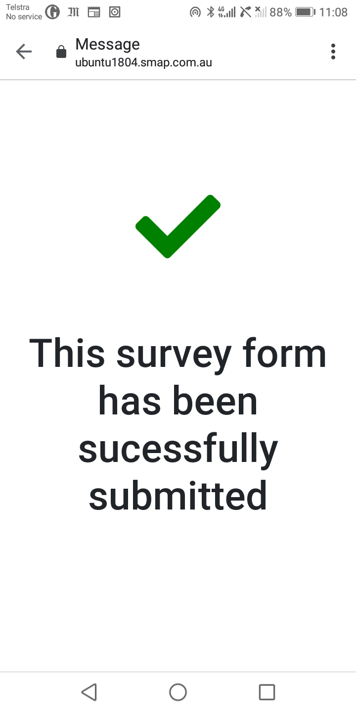

Manage a Campaign
=================

A mailout is associated with a single Survey.  You can add and manage multiple mailouts for each survey. Mailouts use emails, refer to :ref:`email-concepts`
for details on how subscriptions and opting in are managed.

.. contents::
 :local:

Create
------

Select the **Project** and then the **Survey** that you are going to send.  Then select the **Campaigns** menu and **Add**.

*  Enter a name for the campaign
*  Enter a "Subject" to be included with each email sent
*  Enter the "content" of the email

Layout your email content as you want it to appear to the recipient using multiple lines.  The following special terms can be used:

*  ${name}  - This will be replaced by the name of the email recipient in the email
*  ${url}  - This will be replaced by the link to the survey in the email.  If you do not include ${url} in the email content then the 
   link to the survey will be added after the content text.

Example::

  Dear ${name},

  We are conducting a survey on attendees experieces at the recent festival.
  Are you able to complete the following short survey? ${url}.

  thanks

  Karen

   The campaign page

Adding Email Recipients
-----------------------

Email recipeints are added from a spreadsheet.  To get the spreadsheet format you can select the menu **File** and then **Export Emails XLS**.  If you have not
already added email recipients this exported file will only have a header row.

Add details on each email recipient to the **mailouts** worksheet in the spreadsheet

*  email.  Their email address
*  name.   Their name

.. warning::

  The name is only used if a new **contact** is created.  If the contact already exists you can edit their name on the :ref:`contacts` page

The columns **status** and **status_details** are ignored.  They are only used when exporting the emails.

All other columns are interpreted as the names of questions in the top level form and will be used to set the initial value of that question.

When the spreadseet is ready upload by select the menu **File** and then **Import Emails XLS**.

.. note:

  Only emails that are not already in the campaign will be added.  If you select the checkbox "Clear existing unsent emails" then email addresses that have not
  already been sent will be removed. 

Modifying Email Recipients
--------------------------

Once emails have been sent the email recipient cannot be changed or deleted.  However when importing the emails a checkbox is provided to
"Clear existing Unsent Emails". If this is selected then the unsent emails will be replaced with the emails in the spreadsheet. This
way you can manage your list of email recipients in the spreadsheet up until the point you send the emails.

After you have sent emails then you can still add new emails to your mailout by importing from the spreadsheet. Emails addresses that have already been
sent a survey will be ignored.

Sending Emails
--------------

Press the button "Email Unsent" to send all of your emails.

Alternatively if you have already sent emails and some of them failed, perhaps because the user was unsubscribed, then you can press the "Retry" button.
This will send all unsent emails and will also try and send those with an unsubscribed or error status.  

Completing a Mailout Survey
---------------------------

The recipient can click on the link to open the survey. Alternatively they can:

*  Ignore the email
*  Select the unsubscribe link after which they will not be sent any more emails
*  If this is the first time they have been included in a mailout they will first get an optin email message.  If they ignore this
   or select unsubscribe then they will not receive the mailout or any other email messages

Once the survey is sucessfully submitted the user will be shown the following comfirmation message.  If they click on the link again they will see the 
same message as each mailout survey can only be completed once.

   Completion Page

Adding initial Data
-------------------

Each survey sent can be personalised to the recipient by using intial data.   You can do this by adding extra columns to the spreadsheet that has your list
of recipients.  Each column name should correspond to the name of the question that you want to pre-populate.

In the following simple example a single question is prepopulated with the currently understood address of the recipient.

.. figure::  _images/mailout2.jpg
   :align:   center
   :width: 500px
   :alt: Adding initial data to a mailout survey

"address" might be a text question in which case when the user completes the survey they will see that address as the default answer for the question. 
Alternatively you can pre-populate calculation questions and use these to control the logic of how the survey is completed using relevance.

You can add as many columns as you want in order to pre-populate as many questions as required.  However the following column names are
reserved. So if you have one of these as a question name you won't be able to pre-populate it:

*  email
*  name
*  status
*  status_details

Viewing details of an email mailout
-----------------------------------

If you select an email in the table then you can press the **Details** button.  This will show the URL of the link that the user selects to complete the survey.
You can then copy this URL and send it to the recipient by other means if they are having trouble accessing it.

The details popup will also show the initial data to be applied to the survey in JSON format. 
