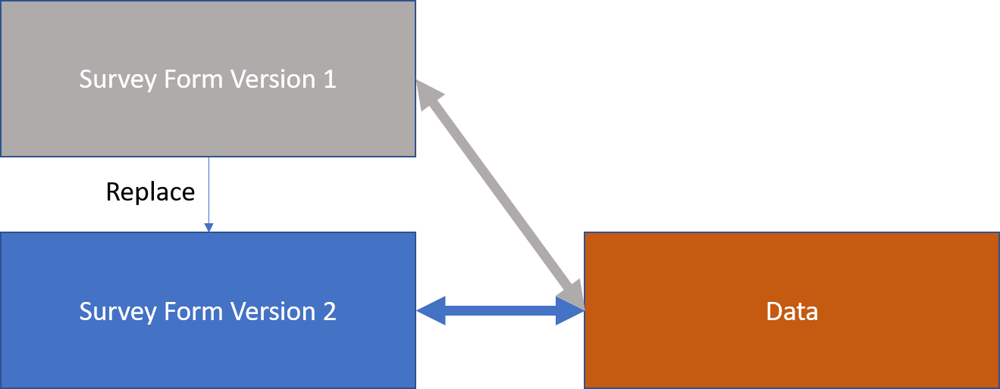
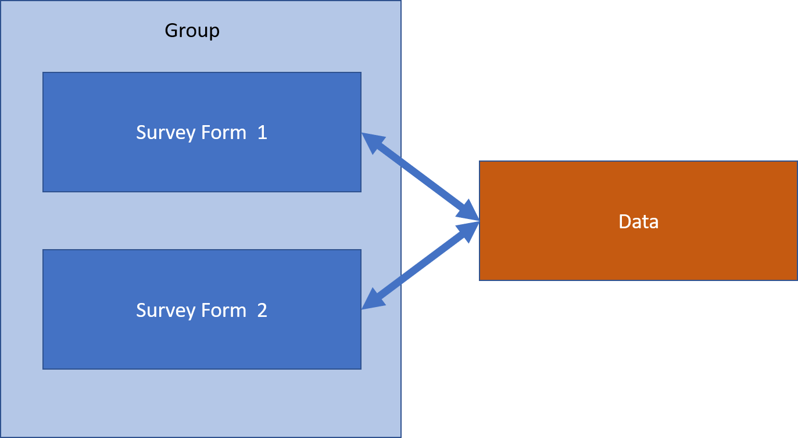

Many Forms - One Table of Data
==============================

.. contents::
 :local:
 

Single Form
-----------

When you load a new Survey Form on to the server a one to one relationship will be created between that form and its data.  Each question in the form
will have a column in the data table that stores its answer.  If you load another survey, even one that is almost identical to the first, then a new
data table will be created and the two sets of data will not be linked in any way.

.. figure::  _images/one_survey.png
   :width:   400px
   :align:   center

   Single form single data table

Data is more important
----------------------

The above approach is as far as most forms based data collections systems go.   However except in rare cases the data collected by a survey is more
important than that survey and this data can exist and be used long after that survey has been forgotton.  To preserve the data while changing the 
survey over time you can "replace the survey" or create "survey variants" that contribute to a single view of the data.  These approaches are described below.

Replacing the Survey
--------------------

In this scenario you want to change the survey over time.  You might want to add, delete or change specific questions.  You don't want to keep 
the old survey form but you do want to keep any data that was collected using that survey form.

   Replace a survey

If you edit a survey using the online editor then you automatically replace the old survey.  Alternatively, if you are using the XLSForm editor, then instead of
uploading the changed survey press the **replace** button (:ref:`replacing-surveys`).  

None of the previously collected data is lost when you replace a survey.  However if a question has been deleted then the data for that question will
not be visible when you are doing analysis with the new survey.   To see this old data then update the survey again and add the question back in.

Concurrent Survey Variants
--------------------------

What if you have multiple on-going data collections where the questions vary?  For example data collected in camp B needs to have different questions than
those used in Cmap A but you are still collecting a single table of data.

One approach to this is to use relevance. You can add the additional questions, make them only relevant if "Camp A" or "Camp B" is selected as the location 
and then replace the original survey with this new one.

Another approach however is to load multiple surveys that are in the same **group** and hence update the same table.  This might be preferred to the use of
relevance if:

*  The relevance rules would be complex
*  Temporary surveys are often being required and you don't want to constantly change the main survey
*  The survey variant is substantially different, possibly with only a fraction of the questions of another survey

   Group Surveys

The following video walks through an example of using this approch in a scenario where two survey variants are used to collect a single set of
data at two camps.

.. raw:: html
  
 <iframe width="560" height="315" src="https://www.youtube.com/embed/hdzpoNF5COk" frameborder="0" allow="accelerometer; autoplay; encrypted-media; gyroscope; picture-in-picture" allowfullscreen></iframe>
