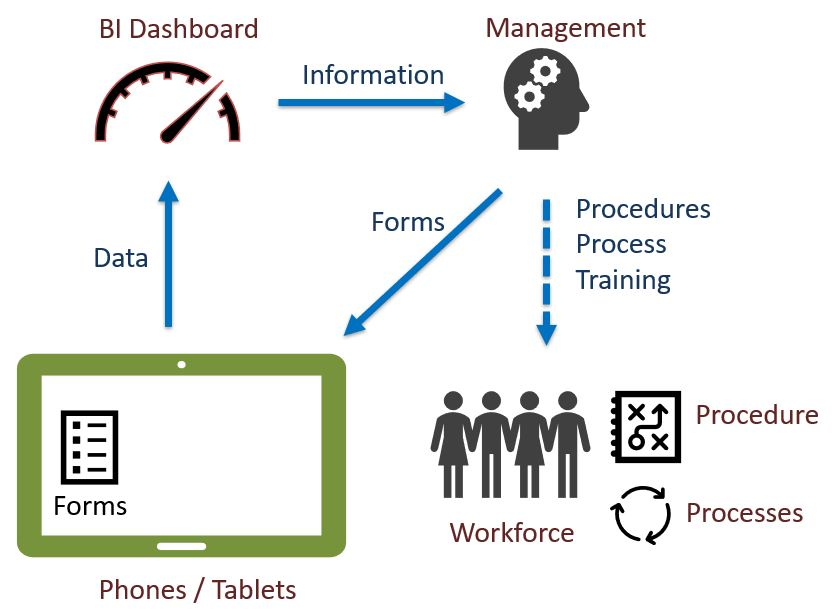

Monitoring & Evaluation
=======================

The most common use of mobile data collection is for Monitoring and Evaluation.  In both of these data is 
collected using forms and then analysed once it has been uploaded to a server.  This analysis can be done using anything from
Business Intelligence Dashboards to spreadsheets.

   Monitoring and Evaluation
  
The results of the analysis can be used to set policy and inform a training program for the workforce.
