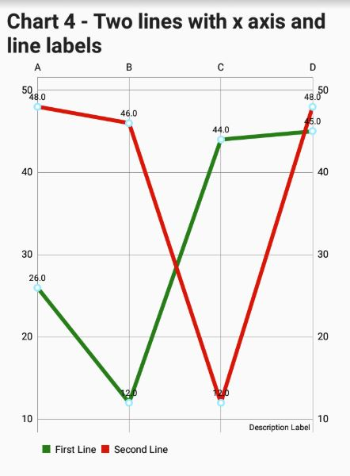
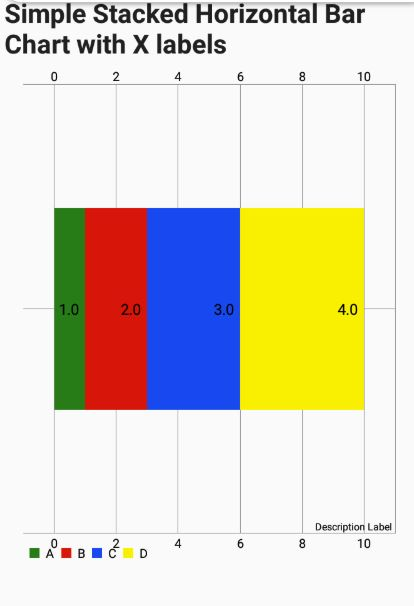
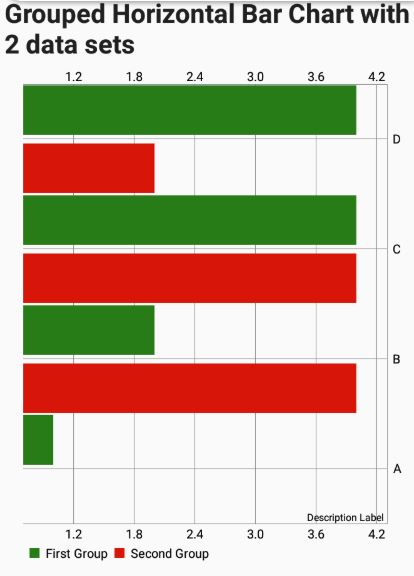

.. _charts:

Charts
======

.. contents::
 :local:
 
An excellent way to provide feedback to a user is by showing them charts of the data they have collected and reference data.  

.. note::

  `Example Survey <https://docs.google.com/spreadsheets/d/19jnl8d86p964IDbEIH3z2pQPoBGep5MJKp_nxA-YhWA/edit#gid=852740487>`_

Adding a Charts
---------------

*  Set the question type to: **chart**
*  Put the data in the **calculation** column.  

Optionally specify the following parameters::

  chart_type=horizontal_bar.  Will show the data as a horizontal bar chart. The default is a line chart
  stacked=yes.  Use with horizontal_bar charts to stack the bars.

Chart Data
----------
The chart data is specified in the calculation column.  You can use text functions such as **join()** to combine 
answers from questions, or values pulled from a CSV file into the correct format.

The rules for constructing data and labels are as follows:

*  Data points are seperated by a single colon  (\:)
*  X Axis Labels are separated by a single colon  (\:)
*  Data is separated from labels using double equals  (==)   Note the labels are placed first.
*  Multiple datasets are separated using double colon  (\:\:).  Each dataset is shown as a line on a line chart, hence you can have
   multiple lines.
*  Labels for data sets are separated from X Axis labels using double colon  (\:\:)  Note the X Axis Labels come before data set labels.

Optionally the X axis numbers can be added to the data.  This can be useful when showing multiple datasets if one of the data sets has missing
data points. Or even in a single dataset if some of the data points are missing and you want this to be apparent on the chart.
To do this separate the X Axis number from the value using hash (#).  The X Axis number comes first. Start the X axis numbers from 0.

For example::

  The second data set does not have a value for the 2nd point in the series (X axis number 1)::
  0#10:1#20:2#30:3#40::0#5:2#7:3#8

Example 1 - Simple Line Chart
-----------------------------

Calculation::

  join(':', '1','2','3','2')
  
.. figure::  _images/chart1.png
   :align:   center
   :width: 	 300px
   :alt:     Simple Line Chart

   Simple Line Chart

Example 2 - Line Chart with X Axis Labels
------------------------------------------------

In this example the data values are first combined with a colon separator.  Then the X Axis labels are combined again using a colon separator. 
Finally the data is combined with the labels using the double equals separator. 

Calculation::

  data:                 join(':', '26','12','34','45')
  labels:               join(':', 'A', 'B', 'C', 'D')
  chart calculation:    join('==', ${labels}, ${data})
  

   Line Chart with X Axis Labels
    
Example 3 - Two Lines with X Axis Labels
----------------------------------------

To show two lines that means showing two data sets. The data is created in stages.  First one data set is created by 
combining the data values with a colon separator.  Then the second data set is created in the same way.  Then these two data sets
are combined using a double colon to separate them.

Calculation::

  dataset_1:            join(':', '26','12','34','45')
  dataset_2:            join(':', '48','36','48')
  combined_data:        join('::', ${dataset_1}, ${dataset_2})
  labels:               join(':', 'A','B','C','D')
  chart calculation:    join('==', ${labels}, ${combined_data})

   Two Lines with X Axis Labels

Example 4 - Two Lines with X Axis and Data Labels
-------------------------------------------------

Now we are adding labels for each of the datasets. In this example the X axis position of each data point is also made
explicit using the # character.  This is used because the 2nd data point in the second data set is missing.

Calculation::

  dataset_1:            join(':', '0#26','1#12','2#44','3#45')
  dataset_2:            join(':', '0#48','1#46','2#12','3#48')
  combined_data:        join('::', ${dataset_1}, ${dataset_2})
  x_labels:             join(':', 'A','B','C','D')
  data_labels:          join(':','First Line', 'Second Line')
  combined_labels:      join('::', ${x_labels}, ${data_labels})
  chart calculation:    join('==', ${combined_labels}, ${combined_data})

   Two Lines with X Axis and Data Labels

Example 5 - Simple Stacked Horizontal Bar Chart
-----------------------------------------------

Parameters::

  chart_type=horizontal_bar
  stacked=yes

Calculation::

  chart calculation:    join(':','1','2','3','4','5','6','7')

   Simple Stacked Horizontal Bar Chart
   
Example 6 - Stacked Horizontal Bar Chart with X Labels
------------------------------------------------------

Parameters::

  chart_type=horizontal_bar
  stacked=yes

Calculation::
  
  data:                 join(':', '1','2','3','4')
  labels:               join(':', 'A','B','C','D')
  chart_calculation:    join('==', ${labels}, ${data})

   Stacked Horizontal Bar Chart with X Labels
   
Example 7 - Stacked Horizontal Bar Chart with 2 data sets
---------------------------------------------------------

Parameters::

  chart_type=horizontal_bar
  stacked=yes

Calculation::
  
  dataset1:                 join(':', '1','2','3','4')
  dataset2:                 join(':', '4','3','2','1')
  combined_data:            join('::', ${dataset1}, ${dataset2})
  x_labels:                 join(':', 'A','B','C','D')
  data_labels:              join(':', 'First Bar', 'Second Bar')
  combined_labels:          join('::', ${x_labels}, ${data_labels})
  chart_calculation:        join('==', ${combined_labels}, ${combined_data})

   Stacked Horizontal Bar Chart with 2 data sets
  
Example 8 - Simple Horizontal Bar Chart
---------------------------------------

Parameters::

  chart_type=horizontal_bar

Calculation::
  
  chart_calculation:        join(':', '1','2','3','4','5','6','7')

   Simple Horizontal Bar Chart
   
Example 9 - Horizontal Bar Chart with X Axis Labels
---------------------------------------------------

Parameters::

  chart_type=horizontal_bar

Calculation::
  
  data:                 join(':', '1','2','3','4')
  labels:               join(':', 'A','B','C','D')
  chart_calculation:    join('==', ${labels}, ${data})

   Horizontal Bar Chart with X Axis Labels
   
Example 10 - Grouped Horizontal Bar Chart with Labels
-----------------------------------------------------

Parameters::

  chart_type=horizontal_bar

Calculation::
  
  dataset_1:            join(':', '1','2','3','4')
  dataset_2:            join(':', '4','4','2','1')
  combined_data:        join('::', ${dataset_1}, ${dataset_2})
  x_labels:             join(':', 'A','B','C','D')
  data_labels:          join(':', 'First Group', 'Second Group')
  combined_labels:      join('::', ${x_labels}, ${data_labels})
  chart_calculation:    join('==', ${combined_labels}, ${combined_data})

   Grouped Horizontal Bar Chart with Labels