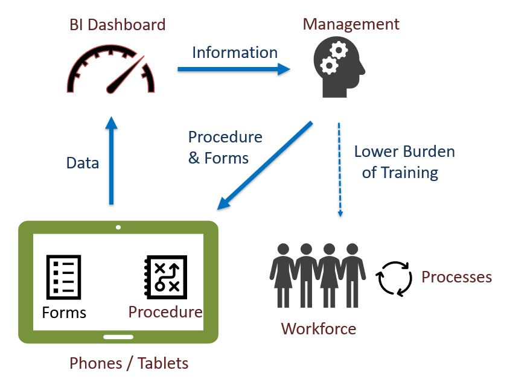

Mobile Workforce Assistance Overview
====================================

.. contents::
 :local:
 
In **Mobile Workforce Assistance (MWA)** type applications data is collected using forms in the same manner as MDC is used for M&E 
however the data is then used immediately to provide context relevant advice to the person being interviewed or the mobile device user.

   Mobile Workforce Assistance

With MWA we can put organisational procedures and training directly into the mobile devices that the field staff use to complete their
work.  

This delivers very significant benefits beyond what is possible with conventional MDC:

#.  A consistent high quality implementation of organisational procedures by staff guided by their phone
#.  Reduced need for basic training.  The forms on the phones can train the staff as they deliver the service as well as
    guide them in how to deliver that service.  This allows
    an organisation to focus its training on more advanced human development.
#.  A dramatic shortening of the time betweeen identifying the need for a program and having the required capabilities to roll 
    that program out.
	
In other words, use of **MWA** can deliver the sort of productivity improvements to service delivery that organisations 
currently achieve in M&E by using mobile devices.

