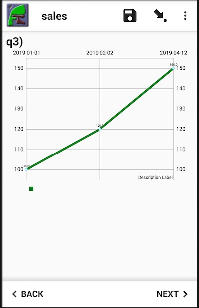

Chart Function
==============

Often you may find that you want to present trends to a user probably by using a chart. Smap provides a function that will retrieve time series 
data submitted in Surveys for use in an MWA type survey.   

However the data does not have to be time series.  The function will return previous
values for a specified column separated by colons.  

.. note::

  `Example Time Series Survey <https://docs.google.com/spreadsheets/d/1WDvjvLczQ-Z3hBBSnSVawb6Lwiz9ItrfcUH8w70coQQ/edit?usp=sharing>`_. This survey asks
  the user to select a school and then the number of girls and the number of boys in attendance.  It then uses the **pulldata** to get data 
  from "chart_self".
  Chart means the data is returned as a timeseries, self tells the function to get previously collected data from its own survey.

The chart function is just the pulldata function where the identifier of the containing the data is preceeded by "chart\_". 
For example the following
pulldata requests will retreive data in a format that can be used by a chart::

  pulldata('chart_self', 'sales', 'region', 'region 1')
  pulldata('chart_s1_456', 'sales', 'region', 'region 1')

The first example will retrieve values from the sales column of the same survey that is making the request. The 
sales values will be retrieved from records where the region is set to 'region 1'. Ie previous submissions.  The 
second example will retrieve sales data matching the specified region in the survey with identifier "s1_456".  

.. note::

  The filter column is required as it is a part of the pulldata function.  Hence you could not kust ask for all the sales
  data in the survey.  This is because pulldata normally expect to just return a value for a single record.  When getting chart
  data however we allow values for multiple records to be returned.
  
Detailed Example
----------------

Here is some collected data that we are going to use in a chart within a survey to show historical sales data.

.. csv-table:: Sales Survey:
  :width: 120
  :widths: 40,40, 40
  :header-rows: 1
  :file: tables/sales.csv

The first pulldata function will get the X axis labels which will be the dates::

  pulldata('chart_self', 'report_date', 'region', 'region 1')
  2019-01-01:2019-02-02:2019-04-12
  
The next pulldata function will return the sales data::

  pulldata('chart_self', 'sales', 'region', 'region 1')
  100:120:150
  
These labels and data points can then be joined using a double equals in the calculation column of a chart.

   Chart of Sales Data

.. warning::

  A maximum of one pulldata() function should be placed in each calculation.  Hence you should not try to put everything into the
  chart's calculation.
  