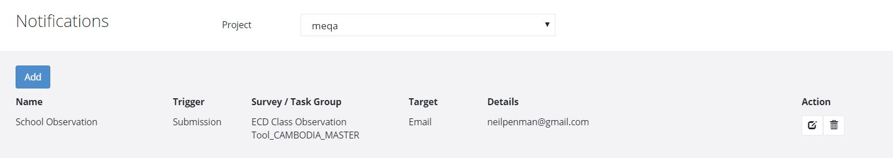

.. _notifications:

Notifications
=============

.. contents::
 :local:

To get to the notifications page select the **Tasks** module and then **Notifications**.

   Notifications Page
   
Trigger
-------

The following can trigger a notification:

*  A submission.  A result submitted from a survey.
*  A task reminder.  If a task has not been completed within the specified time.

Target
------

Notifications can be sent as:

*  An email.
*  An SMS.  Only if SMS has been enabled in the server settings (:ref:`admin-server`)
*  Forwarding of a submission on to another Smap server.

Adding
------

Click the **Add** button.

1.  Give the notification a name
2.  Select the trigger
3.  Select the notification target
4.  Leave the checkbox **Enabled** as checked (unless you want the notification to be disabled) 

The remaining settings will vary depending on the selections made for **trigger** and **target**

.. note::

  Notifications can be sent to multiple email addresses and SMS phone numbers.

Submission Trigger
++++++++++++++++++

Settings are:

*  Survey whose submission triggers the notifications
*  Filter. Restrict which records will trigger a notification.  For example:  "${age} > 80"

Task Reminder Trigger
+++++++++++++++++++++

Settings are:

*  Task Group that contains the tasks that will trigger this notification.
*  Interval.  Duration after the task is created that the reminder will be sent if the task is not completed.

Email Target
++++++++++++

Settings are:

*  Attach.  Attach a PDF of the record or a link to a Webform containing the data.
*  Email.  The email address.
*  A question that contains the email address. (If the trigger is a submission of a completed survey)
*  Subject.  The subject of the email.
*  Content.  The body content of the email.  Data from the submission can be included in both the subject and the content
   using the ${question_name} syntax
   
SMS Target
++++++++++

Settings are:

*  Phone Number
*  A question that contains the phone number in the submission (If the trigger is a submission of a completed survey)
*  SMS Sender Id.  The ID of the sender that is shown to the user when they receive the SMS message
*  SMS content

Forwarding Target
+++++++++++++++++

*  Host.  Where the survey results will be forwarded to. For example https://sg.smap.com.au
*  User.  The user ident on the remote server
*  Password. the password of the above user ident.  (See security warning below)
*  Remote Survey.  The name of the survey on the remote server that the data will be forwarded to.

.. warning::

  The password of the user on the remote server will be stored on the server that you are forwarding from. This password will be
  accessible by the IT systems administrator of this server.  Hence when setting up forwarding it is recommended that you create an
  enum account that only has the security group **enum** to receive the forwarded results.  Do not use an administraot or analyst account.
  
After selecting a target of "Forwarding" a button will be shown labelled "Refresh Form List".  Once you have entered the
host, remote user and remote user password, press this button to get a list of the remote surveys that you can send the data
to. 

.. note::

  The remote survey does not need to be the same as the original survey.  If they are different then only questions in the remote survey
  that have the same name as a question in the source survey will be updated.

