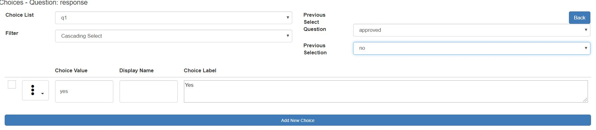

.. _cascading-selects:

Cascading Selects
=================

In a cascading select the response to a **select one** question will determine which choices are shown in another **select one** question. 
For example::

  Question 1: Which country?
    Choices:
      Australia
      Mozambique
  
  Question 2: Which city?
    Choices:
        Maputo
    	Pemba
        Melbourne
        Sydney
		
  If the user selects Mozambique as the country then only the choices Maputo and Pemba 
  will be shown for the second question asking about the city.

You need at least two **select one** questions, then for the dependent question you identify which choices are shown for 
each selection in the first question:

* Create the initial **select one** question
* Create a second **select one** question whose choices will be dependent on the answer to the first
* In the choices panel for the second select question choose "cascading select" from the "filter" drop down. (1)
* In the "Previous Select Question" dropdown select the previous select question (2).

.. figure::  _images/cascading-select1.jpg
   :align:   center
   :alt: Specifying the previous select question
   
   Specifying the previous select question
   
*  Then in the **previous selection** dropdown select one of the choices in the previous **select one** question (3).
*  Then select the checkboxes next to the choices in the second **select one** that you want to include (4)
   
.. figure::  _images/cascading-select2.jpg
   :align:   center
   :alt: Selecting the choices to show at the next level
   
   Selecting the next choices to show
   
In the above image the choices "no" and "maybe" will be shown in select question "response" if the user selected "yes" in the 
**select one** question "approved".

*  Then keep selecting choices from the previous **select one** question until all have been processed.  Each time you select 
   another previous question choice only the remaining choices for the second question are shown. In the image below the previous choice is 
   now "no" and the only choice value available in the next question is "yes"
   

   
   Repeating the selection of choices for a different previous value