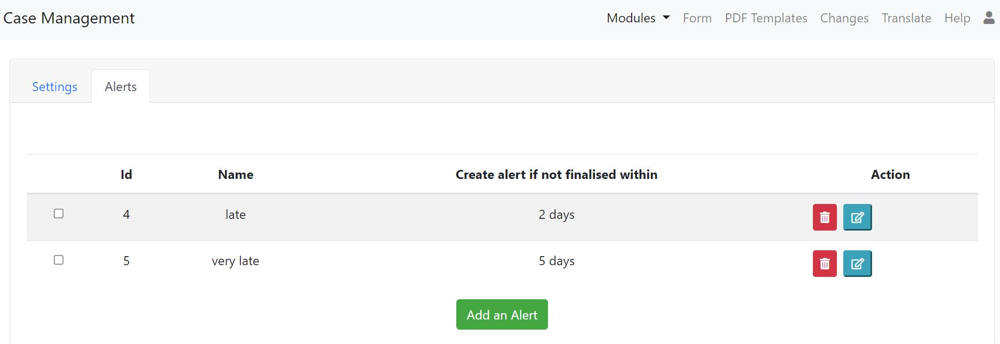

.. _case-management-config:

Case Managment Configuration
============================

.. contents::
 :local:
 
Each survey can have settings related to case management.  These settings are common to a bundle (:ref:`survey_groups`) of surveys.  Hence if you change the settings
for one of the surveys in a bundle it will change the settings for the others. 

Settings
--------

On the settings tab specify:

*  The question that holds the status for a case
*  The status value that indicates that the case is complete

.. figure::  _images/case1.jpg
   :align:   center
   :width: 	 500px
   :alt:     Case management settings form election of a status question and a completed status value

   Case Management Settings

Alerts
------

Alerts have a name and an interval after the case is created when the alert will be raised.

   Case Management Alerts

