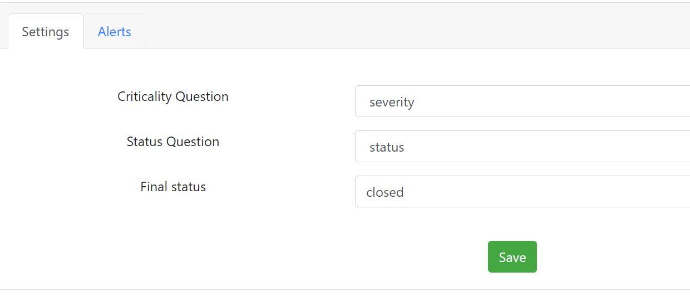
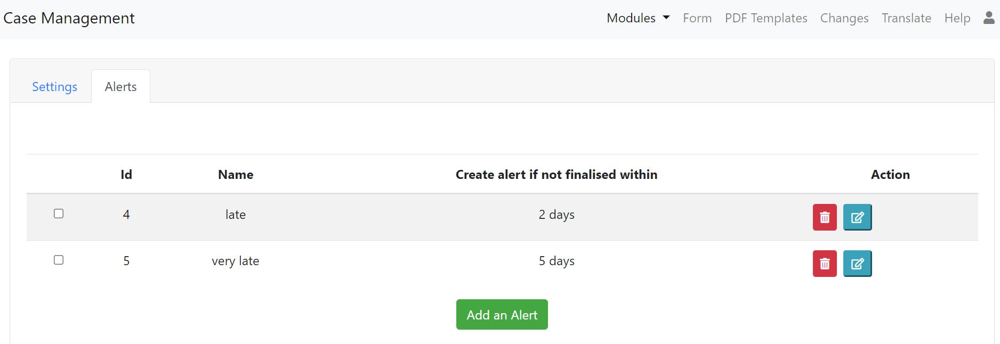

.. _case-management-config:

Case Management Configuration
=============================

.. contents::
 :local:
 
Each survey can have settings related to case management.  These settings are common to a bundle (:ref:`survey_groups`) of surveys.  Hence if you change the settings
for one of the surveys in a bundle it will change the settings for the others.  To access the case management
configuration use the online editor and select the menu **Tools** and then **Bundle and Case Management**.

The page has the tabs **Settings**, **Keys**, **Alerts** and **DHIS2**.

Settings
--------

On the settings tab specify:

*  Bundle Name (Topic).  A name for the bundle, used wherever the bundle is referred to, such as the survey lists and the
   :ref:`operations`.  If it is not set the name of the survey that the bundle is named after is used.
*  Bundle Description.  A description of what the bundle is for.
*  The question that identifies the criticality of the case
*  The question that holds the status for a case
*  The status value that indicates that the case is complete

   Case Management Settings

Keys
----

The key policy and unique key for the surveys in the bundle.  See :ref:`survey_keys`.

Alerts
------

Each alert has:

*  A name
*  An interval after the case is created when the alert will be raised
*  A filter (Optional from release 23.09). If specified this restricts the records that will generate the alert

   Case Management Alerts

DHIS2
-----

Requires SmapServer v26.09.  The mapping used to send aggregate totals from the bundle's data to DHIS2.  See
:ref:`dhis2-export`.
