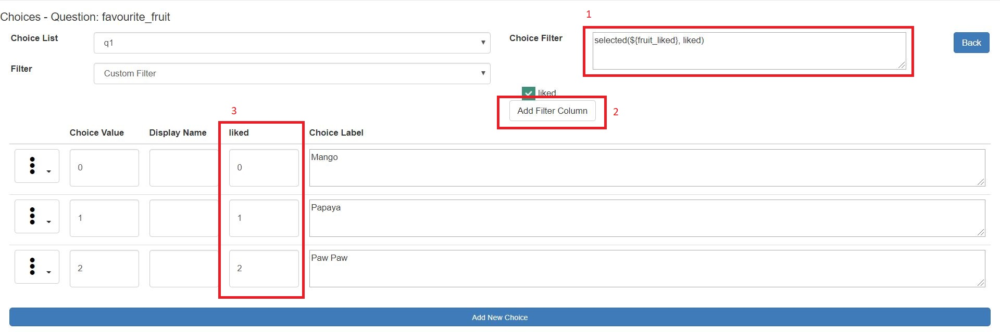

Choice Filters
==============

:ref:`cascading-selects` are a special case of choice filters where the choices for a select question are dependent only on a 
single previously asked select question. However choice filters can be much more flexible and powerful with rules being used
to identify choices that should be displayed that are dependent on the answers to many other previously answered
questions. Because of this flexibility the online editor takes a similar approach to that used by the spreadsheet editor so 
rather than using a point and click interface::

  A choice filter rule is specified that can refer to previously answered
  questions and also to codes associated with each choice.  If the rule evaluates as
  true for a choice then that choice is shown.  

This means that you can do anything in the online editor 
that you can do in the spreadsheet editor but that you may need some specialist knowledge. 

In the following diagram a choice filter is specified so that a question on favourite fruit only include choices selected
by a user for a question on which fruit they liked.

   
   Choices being specified using Online choice Filter

*  "Custom Filter" has been selected from the **filter** drop down
*  A choice filter rule has been specified (1)
*  The **Add Filter Column** button (2) has been clicked once to create a filter column called "liked"
*  Codes have been entered into the filter column(3)

An explanation of the choice filter rule::

  selected(${fruit_liked}, liked)
  ${fruit_liked} refers to the answer to the fruit_liked question
  liked, without the ${} syntax refers to the filter column.  
  So this means that any choice that has a value in the liked column that was selected 
  in the fruit_liked question will be shown

