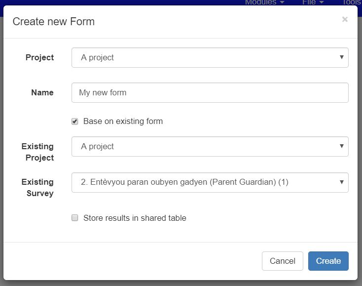

Creating a new Survey
=====================

.. contents::
 :local:

New Empty Survey
----------------

New surveys can be created from the survey management page, click on the **Create new Form** button.  Alternatively go straight
to the survey editing module by selecting **Modules** then **Edit**. Then select the menu **File** then **New**.

Both of these approaches will open the **Create Survey Dialog**.

.. figure::  _images/online1.jpg
   :align:   center
   :width: 	 400px
   :alt:     Create Survey Dialog

   Create Survey Dialog
   
*  Select the project
*  Enter a name for the survey. This name must be unique within the selected project
*  Press **Create**

The Survey Editing page will open with a new empty survey.

Basing the new Survey on an existing survey
-------------------------------------------

In the **Create Survey Dialog** select the checkbox **Base on Existing Form**

   Base on Existing Survey
   
*  Select the existing survey.  This can be in a different project. 
*  Then press **Create**.  

The Survey Editing page will open 
but this time the survey will be pre-populated with the questions, choices and settings of the source survey.

Create a grouped survey
-----------------------

Grouped surveys (:ref:`survey_groups`) store their data in the same tables.  Hence to create a grouped survey
select the checkbox **Store results in shared table** when creating a new survey based on an existing survey. 