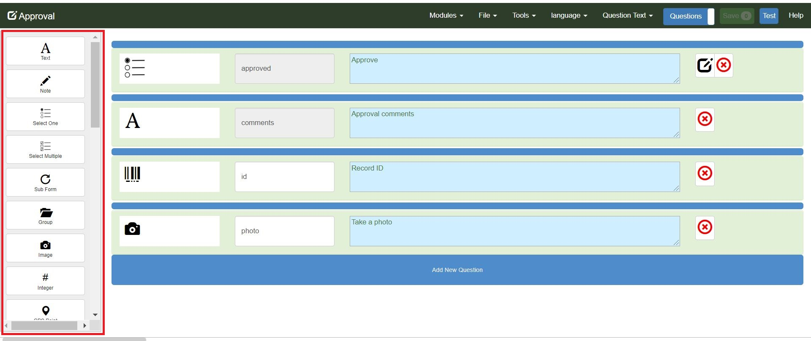
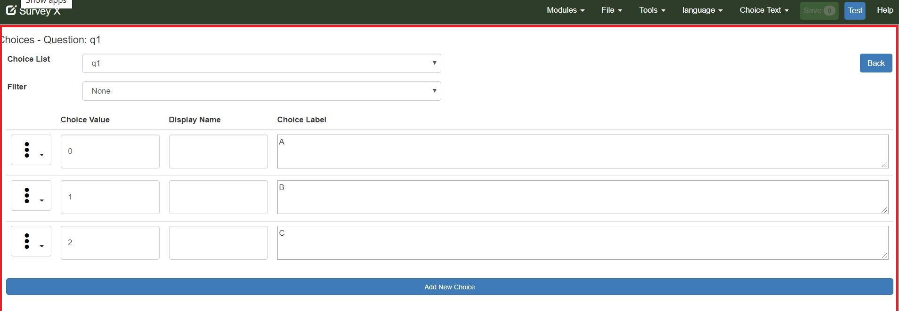
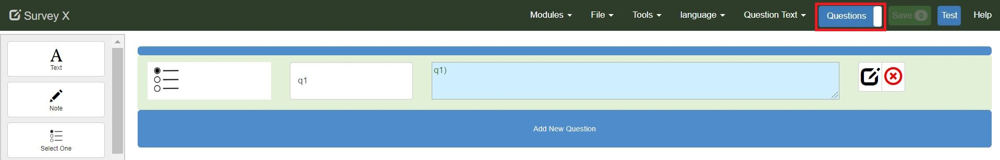

Layout
======

.. _contents:
  :local:

The online editor has 5 panels:

#.  Questions
#.  Menu Bar
#.  Question Type Toolbar
#.  Choices
#.  Choice Lists

Panel 1 - Questions
-------------------

The questions panel is shown when the survey is opened for editing.  It contains the questions in the survey alsong with blue buttons for adding
new questions.  The last button in the panel is labelled "Add new question" and this adds a question at the end of the survey.  The smaller
unlabelled blue buttons between each question also adds a new question at the location of the button.
 
.. figure::  _images/layout1.jpg
   :align:   center
   :alt: Questions Panel
   
   Questions Panel

Panel 2 - Menu Bar
------------------

.. figure::  _images/layout2.jpg
   :align:   center
   :alt: Menu Bar
   
   Menu Bar
  
The menu bar has the following items:

*  The name of the survey being edited
*  Modules. This menu item appears on all Smap Server web pages and allows you to navigate between the modules on the server including 
   the editor, admin, analysis and tasks.
*  File.

   *  Save. Save the changes you have made to the form
   *  Open. Open an existing survey for editing. You can also open a form for editing by clicking on its name in the form management page
   *  New. Create a new form
   *  Languages. Create, Rename and Delete languages used in the form
   *  Repeating pulldata.  Used with case management applications when accessing data from other surveys that contain repeats.
   *  Media. Upload and delete media files attached to this form
   *  Settings.
   
     * Change the form name
     * Move the form to a different project
     * Set the default language
     * set the name of form instance that is displayed on the fielTask screen, you can incorporate answers to questions in the name using the ${question_name} syntax
     * Allow data from a CSV file to be uploaded into this form
     * Add a PDF template to use when saving the a survey instance
	 
   *  Keys. Set a unique key for each submitted record
   *  Roles. Roles applied to this survey.
   *  Info.  Information about the survey such as its identifier and tables used.
   *  Export. Export the survey in XLSForm format.
   
*  Tools. Productivity tools to make quick changes to the form
   * Make required. Set all questions to be required except for read only note questions
   * Make not required. Set all questions to be optional
   * Translate. Quickly translate question and choice labels to another language. These translations can also be done in the questions view, however the translate page will be quicker and easier
   * Validate.  Check the survey for errors.
   * Changes. The changes that have been applied to this form.
   * Meta Items.  Add / remove and edit meta items such as start time.
   
*  The name of the current language. Select this to change the current language
*  The name of the current property. Initially this will be set to "Question Text". Select this to change the current property
*  Question / choice list toggle Switch between viewing the questions and the choice lists
*  Save button (Green) to save the form. Shows the number of changes that are ready to be saved. This button will be disabled if there are errors or no changes have been made.
*  Test button (Blue) to test your form in web forms
*  Help shows this web page that you are currently reading  

Panel 3 - Question Type Toolbar
-------------------------------

Click on a question type in this toolbar to add it to the end of the survey.  Alternatively you can drag a question type onto the questions
panel and drop it on one of the blue **Add Question** buttons to add the question type in a specific location.

   
   Question Types
   
Panel 4 - Choices
-----------------

The choices panel replaces the question panel when you click on the edit button of a select question.

.. figure::  _images/layout4.jpg
   :align:   center
   :alt: Selecting the Choices Panel
   
   Selecting the Choices Panel
   
The choices panel for that question is then displayed and you can add, edit and delete choices. Click on the button labelled "back"
to go back to the questions panel.

   
   Choices Panel

Panel 5 - Choice Lists
----------------------

The online editor allows you to continue using choice lists as you can in the XLS Form editor.   To select the choice list panel
click on the toggle button.  As this is a toggle button it's label shows what is currently selected and not what you will see when you
click on it.  So in the questions panel this button will be labelled "Questions".

   
   Selecting the Choice List Panel
   
Once in the choice list panel you can manage your lists of choices.   Click on the toggle button, now labelled "Choices" to go back
to the questions panel.

.. figure::  _images/layout7.jpg
   :align:   center
   :alt: Choice List Panel
   
   Choice List Panel