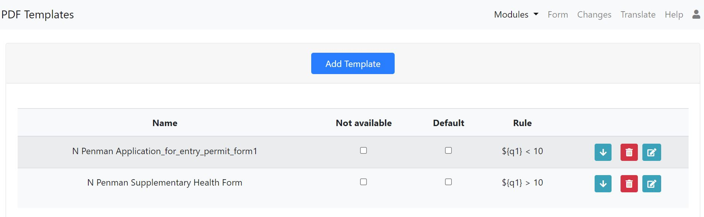

PDF Templates
=============

Multiple PDF templates can be associated with a survey and used to format the contents of a submission into a 
PDF.  These templates can be created and modified from within the online editor by selecting the menu option 
**tools** and then **PDF Templates**.

   PDF Templates page

Multiple templates can be loaded and the required template selected when manually generating a report.  Alternatively,
if the PDF file is created automatically in a notification, then a rule can be specified to select the correct 
template according to the data in the record. Templates can also be disabled, so that they are not considered for
use, or set as the default.

The order in which templates are automatically selected are:

*  A template with a matching rule
*  The default template
*  No template

