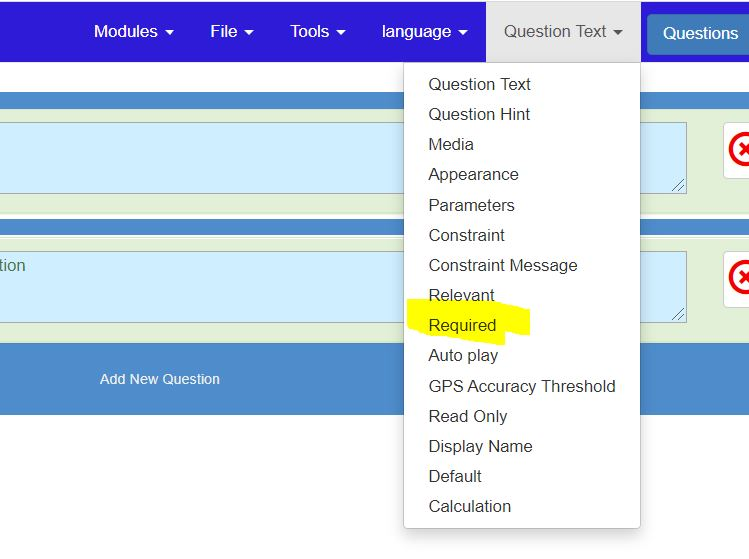
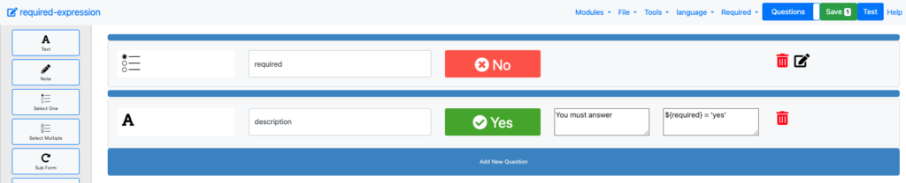

Making Questions Required
=========================

.. contents::
 :local: 

Individual Questions
--------------------

Set the property to be edited to **Required**. The properties menu shows the property that is currently selected
, the default property is **Question Text**.

   Selecting the Required Property

Then for each question you can toggle the question between required and not required.

   Setting required on each question

If a question is set as required then you can optionally add an expression that makes this conditional.  If you
leave that expression blank then the question will always be required.

Set or unset all questions as required
--------------------------------------

A much easier way is to use the **Tools** menu to set all questions required or not required at once.
This approach will safely only set questions to required that should be required.  Note type questions and 
groups will not be set required.

