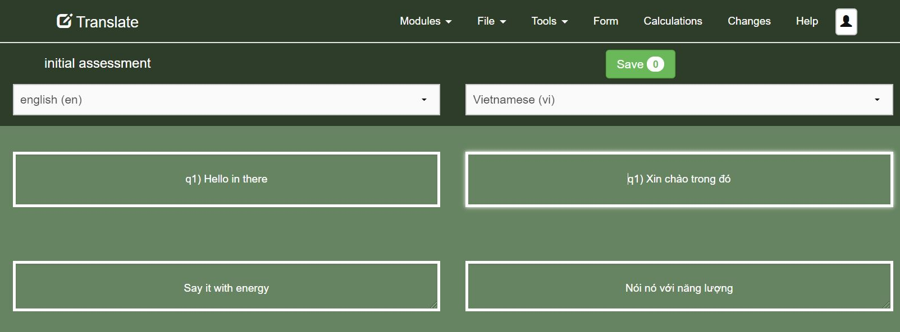

Translations
============

Access the translations page by selecting the menu option **Tools** and then **Translate**.

The labels for two languages will be shown.  Those on the left will be read only and those
on the right will be editable.  You can select the languages for each side of the screen using the drop down controls at the 
top of the page.

Once you have set the left hand side to the reference language make changes to the text on the right to match.  You can save your changes by clicking 
the **Save** button.

   
   Translating

