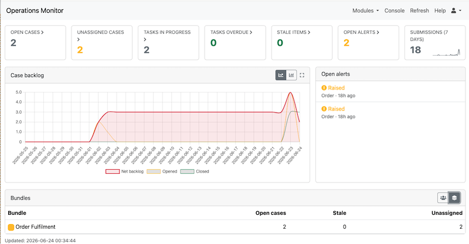

.. _operations:

Operations Monitor
==================

Available with Smap Server version 26.06+.

.. contents::
 :local:

The Operations Monitor is an organisation-wide view of case management and
workflow for senior managers. It answers four questions at a glance: what is the
workload, what is the trend, what is falling behind, and how are the units
performing. To open it select the ``modules`` menu and then ``Operations``.

   The operations dashboard

Access is restricted to users in the ``admin`` security group. Data is scoped to
your organisation and is further filtered by role-based access control (RBAC): a
security manager sees every survey, while other users (including plain admins)
only see the cases, tasks and alerts for surveys they have unfiltered role
access to.

The page is laid out in drill-down layers. The overview (L0) is the landing
page; clicking a tile, a unit row or an alert opens a more detailed view, which
in turn links down to a single record.

::

  L0  Overview        KPI tiles, backlog trend, open alerts, units table
        |
  L1  Unit (role)     one role's workload, throughput, overdue %, at-risk items
        |
  L2  Record list     the specific overdue / stale records
        |
  L3  Record          the case viewer (view + assign / release)

Overview (L0)
-------------

KPI tiles
+++++++++

A row of tiles across the top shows the headline numbers, each with a 30-day
trend sparkline and a red/amber/green (RAG) colour:

* **Open cases** - open case records (not closed, not flagged bad).
* **Unassigned cases** - open cases not yet picked up by anyone.
* **Tasks in progress** - tasks that are accepted or unsent but not yet submitted.
* **Tasks overdue** - tasks whose finish time has passed and that are not submitted.
* **Stale items** - any open task or case older than the organisation's stale interval.
* **Open alerts** - open case-management alerts.
* **Submissions (7 days)** - submissions received in the last week.

Most tiles are links. Clicking *Open cases*, *Unassigned cases*, *Tasks in
progress*, *Tasks overdue*, *Stale items* or *Open alerts* opens the record list
(L2) filtered to that type.

Case backlog
++++++++++++

The backlog chart plots, over the trend window, the cases **opened** and
**closed** per day together with the cumulative **net backlog** (opened minus
closed). A rising net backlog means cases are being raised faster than they are
being resolved.

Open alerts
+++++++++++

The open alerts list shows the current case-management alerts, coloured by
priority (high, medium, low) and showing the bundle and how long ago each was
raised. Each alert links straight to the record it concerns.

Units (roles)
+++++++++++++

A *unit* is a role from the ``role`` table - the organisation's unit of
structure - not a security group. The units table lists one row per role that
currently owns open work, with its open cases, open tasks, overdue tasks and
overdue percentage. Each row is RAG-coloured on its overdue percentage (amber at
or above the amber threshold, red at or above the red threshold). Click a role to
open its unit detail page (L1).

Two reconciliation rows may also appear at the foot of the table so the figures
add up:

* **Unassigned** - open cases with no owner.
* **No unit** - work owned by a user who is not a member of any role.

These rows link to the matching record list (L2). Non-security-managers only see
the roles they are a member of.

The time the figures were generated is shown beneath the table. Use the
``Refresh`` menu item to recompute the overview (results are cached briefly per
user, so a refresh forces a fresh read).

Unit detail (L1)
----------------

Reached by clicking a role in the units table, the unit page shows that one
role's performance in depth:

* open cases, open tasks, overdue count and overdue percentage;
* average case cycle time and average task cycle time, in days;
* a **throughput** chart with two series - cases closed and tasks completed per day;
* a per-unit backlog chart;
* an **at-risk items** table listing the role's overdue tasks and stale open
  cases, each linking to the record.

Record list (L2)
----------------

Reached from a KPI tile or a reconciliation row, the record list
(*At-risk records*) is an organisation-wide table of the records behind a tile -
overdue tasks and stale open cases. Each row shows the item type, title, bundle,
assignee, age in days and an overdue/stale flag, and links to the record. The
list is capped at 100 rows.

Case viewer (L3)
----------------

Case links open a dedicated, organisation-scoped case viewer rather than the
console. This lets an admin open a case in any project in the organisation,
without needing to be a member of that project. The viewer shows the case
metadata (owner, open/closed state) and its field values, and lets the manager
**Assign** the case to a user or **Release** it.

Configuration
-------------

The thresholds are set per organisation on the ``Operations`` tab of the admin
settings page (``admin`` module, settings). The configurable values are:

* **Stale interval (days)** - any open task or case older than this counts as stale.
* **Trend window (days)** - the period covered by the sparklines and backlog chart.
* **RAG amber threshold (overdue %)** - the overdue percentage at which a unit turns amber.
* **RAG red threshold (overdue %)** - the overdue percentage at which a unit turns red.

The defaults are a 30-day trend window, a stale interval applied to both tasks
and cases, and RAG thresholds of amber at 10% and red at 25%.

Email digest
------------

An **Operations Summary** can be emailed on a schedule. It is configured as an
ordinary periodic email notification: when editing a periodic email
notification, choose *Operations Summary* as the report instead of a survey
report. The digest is an XLSX workbook with sheets for the KPIs, the units (RAG),
the at-risk records (overdue and stale) and the open alerts, and is sent to the
notification's recipients on its schedule.
