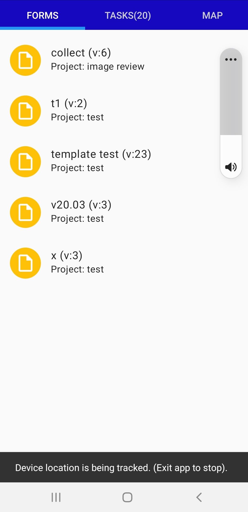

Location Privacy
================

.. contents::
 :local:  

It is important to consider the privacy of both the people who are being interviewed (interviewee) and the enumerator (interviewer).  This article considers just one type
of sensitive information which is the physical location of a person or thing captured using GPS coordinates. Other sensitive information might include names,
identity card numbers etc.

Capturing Location in Surveys
-----------------------------

Location Questions
++++++++++++++++++

Specific questions can be location questions which ask the user to record the location.  These can be a concern for the privacy of the interviewee.  

Survey Background Questions
+++++++++++++++++++++++++++

You can also specify that location be captured in the background while a survey is in progress.  This can be be done by adding a location preload that records the 
location where the survey is started or by specifying an audit option to record the location of where all questions are asked in the background.

When either of these techniques are used a message will be shown when the survey is opened::

  This form tracks your location. You can disable tracking in the menu above.

If you then click on the menu you will see a "Track Location" checkbox that can be turned off.

Capturing Location outside of a Survey
--------------------------------------

The standard version of FieldTask, MEQA and InformEd apps that are available in Google Play and downloadable from Smap servers **do not** track location outside of
a survey.

When you select the tasks or map tab you may be asked permission to record location.  However this location information is used only for geo-fencing when 
the app is in the foreground.  In other words to alert you when you are near a task that has been set up to be enabled when the user is within a specified 
distance.  The locations are not saved and are not sent to the server.

Custom Corporate App Variants
-----------------------------

Some custom variants that are branded for a specific organisation do record location continuously and do share it with the server. This feature needs
the location recording to be added in the software code so if you want this capability you will need to request a custom variant of the app. If you have one
of these then the following considerations apply.

Enabling Tracking
+++++++++++++++++

Tracking still has to be enabled for an organisation on the server.  In the mobile app settings for your organisation set "Send location data on path of user" 
to "on" or "off".

Granting Permission on the Device
+++++++++++++++++++++++++++++++++

When the user starts the app they will be asked if they want to permit location recording.  They will also be given the option to enable recording while
the app is in the background.

Detecting Location Recording
++++++++++++++++++++++++++++

If location recording is enabled then every time the user refreshes the "Forms" tab they will see the following message at the bottom of the screen::

  Device location is being tracked (Exit app to stop)

   Indicator message that background location recording is in progress

Ending Location Recording
+++++++++++++++++++++++++

When the user is no longer working they can switch off recording by selecting the menu and then selecting the "Exit" option.  The next time they start the app
location recording will be re-enabled.

