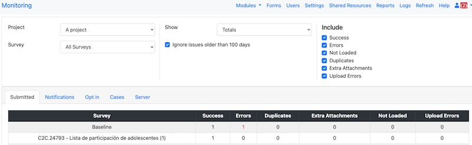
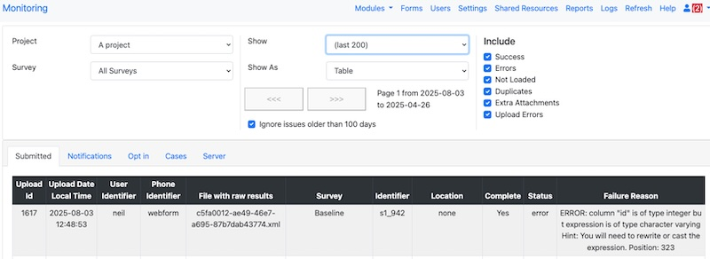

Problem Resolution
==================

.. contents::
 :local:

Submitted Data does not appear in the console or analysis module
----------------------------------------------------------------

The first place to look is :ref:`admin_monitor`,   Select the "submitted" tab and see if your survey has
anything in the "Errors" column.

   Monitoring Page Showing an Error

To view the reason for the error; change "Show" to "Last 200".  This will show details on each
submission.  You can filter to only show Errors if you want to zero on the errors.

   Error Details

In the above image, the error is caused by an answer of type "text" (character varying) being written
to a column of type integer in the database.  The column name is "id".  When you are editing a survey you cannot
change a question of type integer to text.  If you come across this follow the instruction in
:ref:`prob_type_change` to resolve it.

.. _prob_type_change:

Question type has changed to an incompatible value
--------------------------------------------------

The easiest way to fix this is to :ref:`analysis-delete-restore` the survey in the analysis module.

.. warning::

    Restore first deletes the old data including its table then recreates it with the latest
    survey definition, so the latest question types, it then reapplies all of the submissions.
    However this won't always work.  **Firstly** if you have changed the data since it was submitted then
    you will lose all of those changes.  **Secondly** if you changed the data type from say "text" to "integer" and
    if some of the early submitted data was values like "Only One" then that will now fail when the submissions
    are reapplied.  However changing integer to text should always work. In both of these cases you will
    need to use one of the other methods described below..

