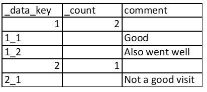

.. _pulldata-subforms:

Pulldata from Subforms
======================

.. contents::
 :local:
 
Recommended Approach
--------------------

This approach is only available in FieldTask version 6.200 and above.  It is not available in WebForms.

You may need to review data from another survey's Sub Form (begin repeat) while working offline.  For example while 
operating offline you may want to show previous results for the last 3 inspections of a piece of equipment.

Use the 6 parameter version of the pulldata function.  :ref:`multi-value-pulldata`

.. csv-table:: Pulldata in a Subform: 
  :width: 200
  :widths: 20,20,40, 40, 80
  :header-rows: 1
  :file: tables/pulldata.csv
  

Old Way (obsolete)
------------------

.. warning::

  This is the clunky old way of getting data for subforms.  The new pulldata() function available in FT 6.200 and above now supports 
  looking up multiple values and you should use that approach instead.

.. note::

  `Example Survey <https://drive.google.com/drive/u/0/folders/16dI2RPsMadTQTRLi_pIuZJ8XIJPjqdoA>`_. This survey  shows comments from 
  previous visits and then gets a comment from the current visit.

To look up data from another survey you will need its identifier. (:ref:`survey-ident`). For a normal pull data this identifier just needs
to be specified in a **search** function or **pulldata** function in order to get lookup data in the survey.  However in this case, since 
data from sub forms is also required we need to specify that a csv reference file be generated containing the sub form data grouped
by data in the main form.

This can be done in the online editor by:

#.  Selecting the menu **File** then **Repeating Pulldata**
#.  Enter the survey identifier in the survey field
#.  Enter the data key.  
#.  Then press **Save**

Once this is done you will be able to look up the repeating data by specifiying the data key value and all the repeats matching that
key value will be returned.

.. figure::  _images/sf_pd.jpg
   :align:   center
   :width: 	 400px
   :alt:     Repeating Pulldata

   Specifying Repeating Pulldata

Resultant CSV File (obsolete)
+++++++++++++++++++++++++++++

   Repeating CSV File
   
The CSV file has two special columns

#.  _data_key: Contains the value of the key for each record
#.  _count: Contains the number of repeating records for that key

The other columns contain the data that you request in your pulldata() functions

In the _data_key column are the unique keys that the pulldata function can use to extract the data.
Where the record is for data within a begine repeat then these have an “_” and a number appended to the key.  So in the example above the key value of “1” has two repeating records with key values “1_1” and “1_2”

The pulldata function (obsolete)
++++++++++++++++++++++++++++++++

Identify the form using::

  linked_s_pd_{survey identifier}
  
**linked_s** means get the data from another survey and not from a CSV file.  **_pd** means the data will be in the repeating pull data format.

Example::

  pulldata('linked_s_pd_self', 'comment', '_data_key', ${visit_key} )
  This means get the value from the question comment from previous submissions to this survey 
  where the key is the value in the question called 'visit_key'.
  
