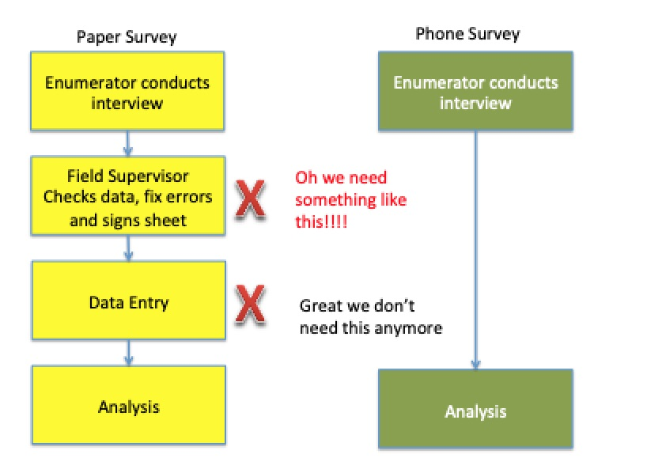

Quality Assurance
=================

.. contents::
 :local:  
 
Mobile data collection can provide much higher quality than paper surveys however as the process is different some
of the techniques you may have used for paper surveys are less easiliy applied and have to be replaced with different 
quality measures.

   Differences between paper and phone based assessments
   
.. note::

  Having a field supervisor check surveys is possible with Smap however it is not as often uses as it is with paper surveys.  You can:
  
  *  Enable opening the surveys for review by selecting that option in the Mobile App settings on the users page
  *  The supervisor can then open each instance and review it on the phone
  *  They won't be able to make changes to the answers but they will be able to add notes to each question
  
Relevance
---------

Use relevance to ensure that questions that need to be asked are asked.  This is much more reliable and consistent than relying on the judgement
of the enumerator to decide which questions should be skipped.   However if the analyst makes a mistake in specifying the relevance then you
also cannot rely on the enumerator working around that mistake.  The form will have to be updated and then downloaded to all the phones.

Reviews
-------

Review the data as soon as it is submitted and while the assessment is ongoing.  The data being made available on servers in a timely 
fashion is one of the advantages of using mobile data collection and can greatly assist quality. Of course this assumes that you are 
not doing all of your interviews offline before uploading all the data in one go.  Some of the questions you may want to ask each day are:

*  Have we got the number of surveys we expected? Use the :ref:`console`
*  How many surveys have been submitted by each user? By each device?
*  Does the data look like we would expect? Create charts in the analysis module or export to XLS.
*  Where was the data collected? If you are not recording location in a question in the survey you could consider using the start-geopoint meta
   question. Refer to :ref:`meta_items`
*  When was the data collected?  Check the start and end time of the survey.  These are recorded in meta questions which are automatiacally added
   to every survey.
*  How long did the survey take?  Export to XLS and subtract the start time from the end time to see the duration.  You can sort by this new
   column to see which were the shortest and longest surveys.
 

Constraints
-----------

Restrict the entry of data to sensible and consistent values.  However this will not prevent the enumerator from entering a feasible but
wrong value so you are still largely dependent on the skills and dedication of enumerators for accuracy.

Make all questions that required.  Except those that shouldn't be required such as notes.   You can use the "Set all questions required"
option in the tools menu of the online editor. 

Auditing
--------

Use :ref:`auditing-servey-completion` to detect poor quality or fraudulent data entry.

Hints
-----

Provide hints to the enumertors in how to ask questions.

Data Cleaning
-------------

Finally after the data is collected if you identify problems, in particular with the responses to text questions use ** Data Cleaning** in 
the analysis module to fix them.  You can also edit results in the console.  Both of these approaches create an audit log of all changes made.

