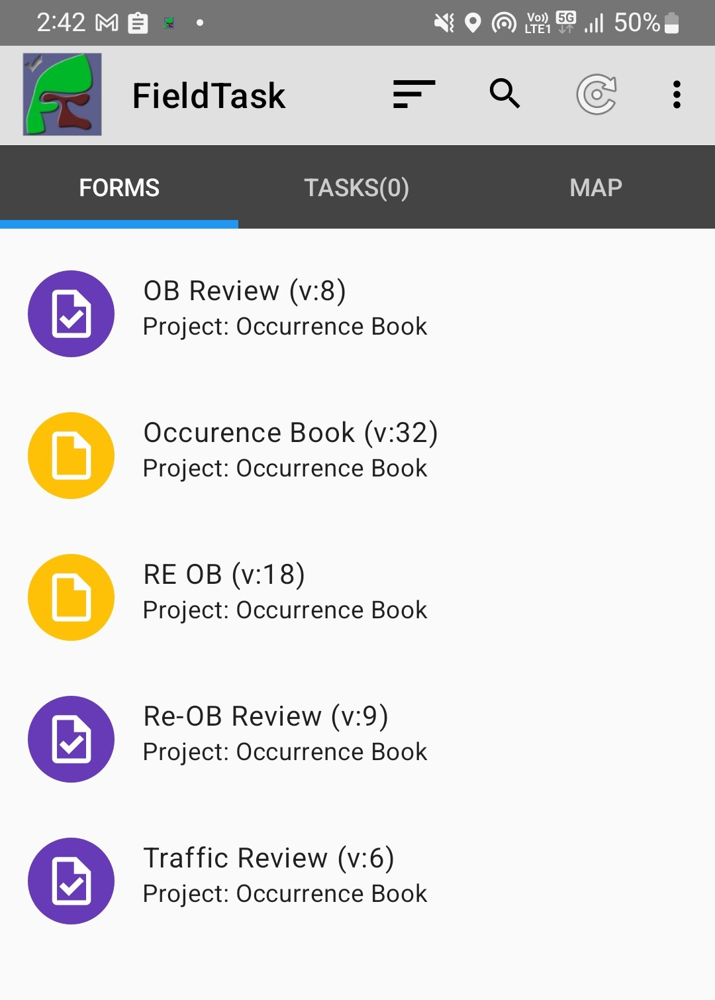

.. _read-only-surveys:

Read Only Surveys
=================

.. contents::
 :local:  
 
Requires::

  Smap Server 22.11
  FieldTask 6.803

You may have a requirement to look up data purely for reference.   For example a survey that allows a user to 
select a product and then view the details of that product.  In this case it may not be necessary to send any 
new data to the server.   Read only surveys can be used for this purpose.

.. note::

  Shouldn't the questions in a read only survey be read only by default.  Well actually no.  You may well need
  to enter keys in order to look up data, such as in the example above when a product is selected to see the
  product details.  If you don't want the reference data to appear modifiable then you can set those questions
  to be read only in the survey.

Making a survey Read Only
-------------------------

In the online editor select the menu **file** and then **settings**.  Check the checkbox marked "Read Only".

In the spreadsheet editor set read_only_survey to **yes** in the settings worksheet

.. csv-table:: Settings Worksheet
  :header: read_only_survey

  yes

Identifying Read Only Surveys
-----------------------------

Read only surveys are shown in purple in the administration page and in fieldTask.

   fieldTask with read only surveys
   
Behavior
--------

Read only surveys will work the same as normal surveys in fieldTask and webForms, with the exception of the
last page.  Instead of showing a "Save and Exit" button on the last page, the button will just say "Exit".  
No data will be saved and no data will be sent to the server.
