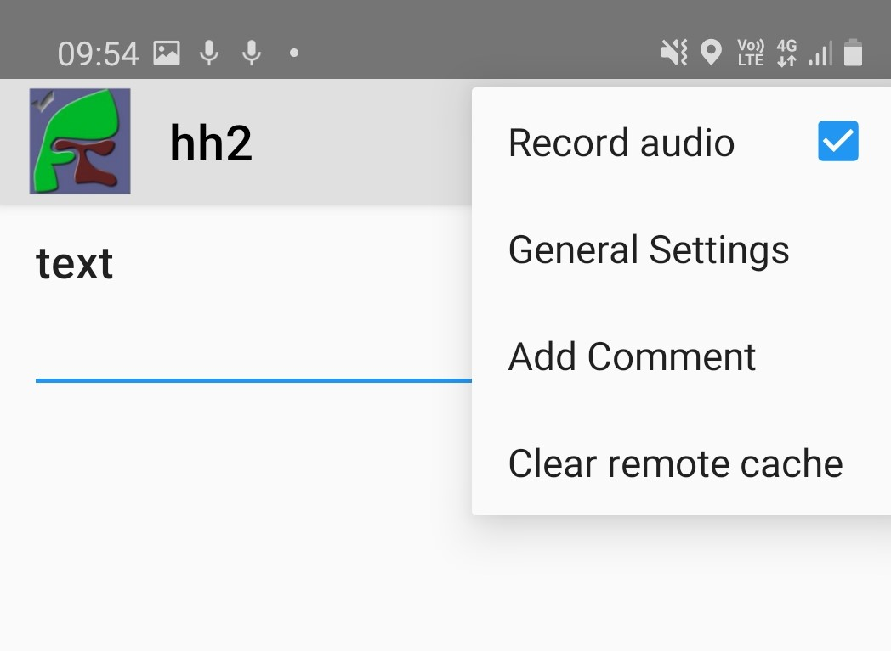

.. _meta_items:

Meta Items
==========

Data for meta items is collected automatically without asking the user.  Hence no label is required and you 
only need to specify the type and a unique name.  

.. note::

  Smap automatically adds the start time, end time and device id 
  to every new survey as this information is important for quality assurance of the data. Hence
  you will not need to specify these meta item	
  
.. csv-table:: Meta Items:
  :width: 50
  :widths: 10,40
  :header-rows: 1
  :file: tables/meta.csv

.. _background-audio-recording:

Background Audio Recording
--------------------------

**Type**
  background-audio

**Parameters:**

*  quality:   (Optional) Set equal to ``normal``, ``low`` or ``voice-only``. Refer to :ref:`audio-quality`

**Availability:**

*  FieldTask: yes
*  Webforms:  yes

Added in FieldTask version 6.300

Audio is recorded while the survey is open.  It will record all sound during survey filling as opposed to a question type of :ref:`audio` which records audio at specific points during the survey.  If the survey is saved and exited, the audio recording is suspended and then when the survey is restarted the background audio recording also restarts.

.. rubric:: XLSForm

.. csv-table:: survey
  :header: type, name, parameters

  background-audio, my_recording, quality=low

.. warning:

  Ethical and legal considerations need to be considered before enabling background audio recording.

Turning off background recording
--------------------------------

If the data collector needs to turn off background recording during survey completion then they can do this using the menu.  Audio recording stops and any previously recorded audio is deleted. Recording can't be resumed during the current survey filling session. Switching the audio recording option back on indicates that the next survey filling session should be recorded. If audit question changes in :ref:`auditing-survey-completion` is enabled, then a ``background audio disabled`` event will be logged if a data collector switches off recording and a ``background audio enabled`` event will be logged if a data collector switches it back on.

   Enabling or disabling background audio recording
