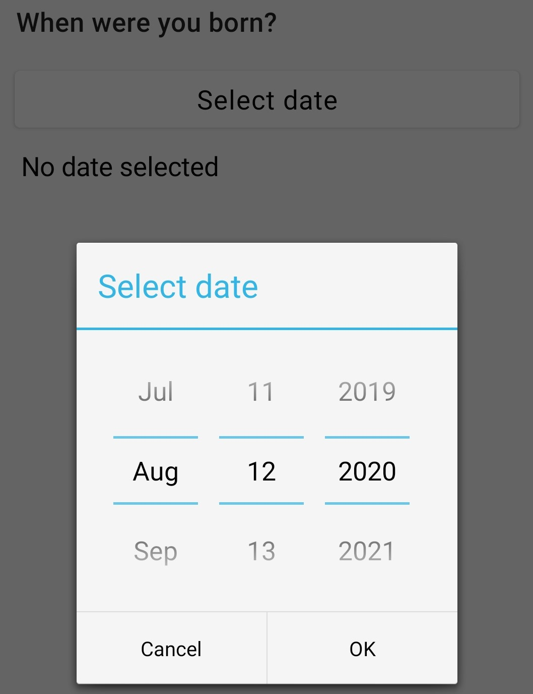
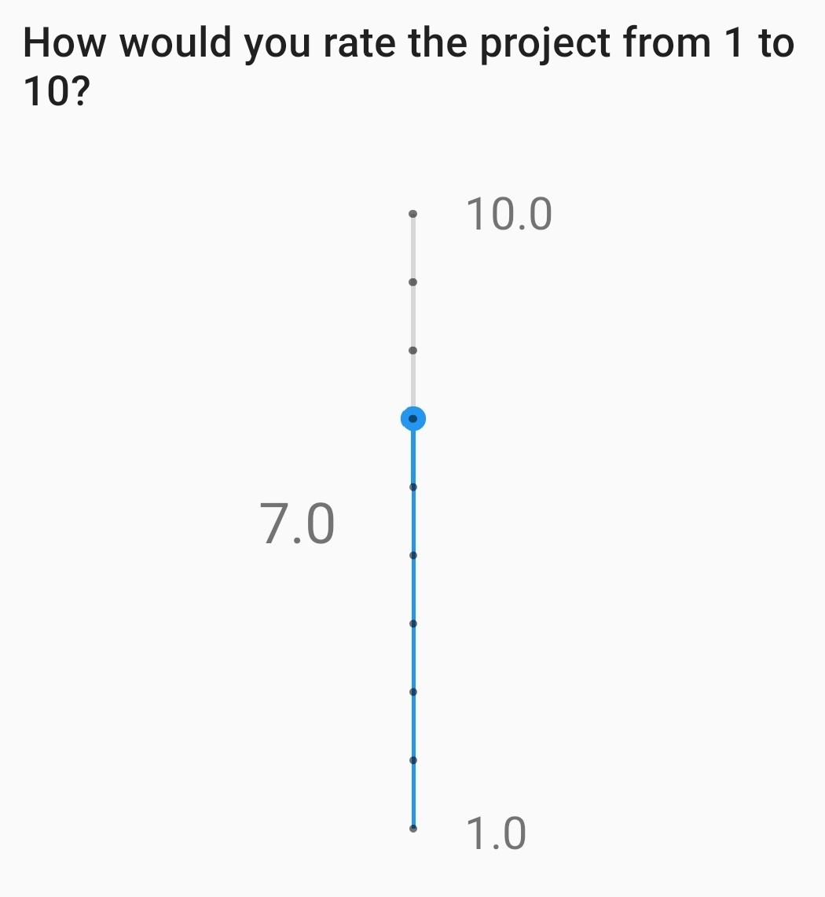
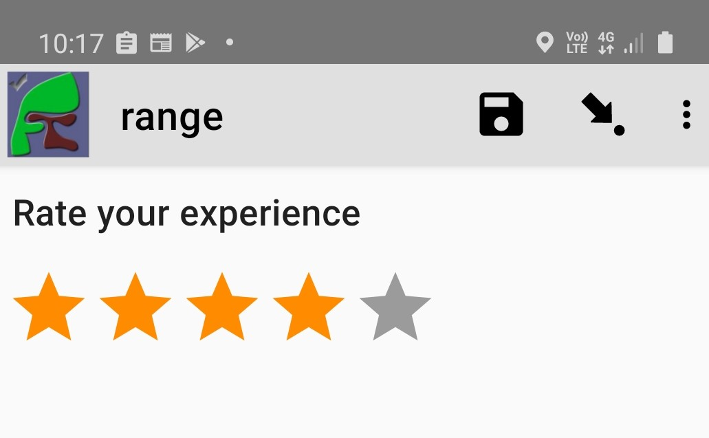

Question Types
==============

.. contents::
 :depth: 1
 :local:  
 
text
----

Use for questions that require a text response.  It can also be used with the numbers appearance to get integer responses that are longer
than the 9 character limit of the **integer** type.

**Type**
  text

**Parameters:**

*  rows:   Set the number of rows of text shown in the form

**Appearances:**

*  numbers:  Shows the numeric keyboard 
*  thousands-sep:  Inserts a separator between thousands when "numbers" is also used
*  url:  Allows the user to open a URL.  Specify the url in the **default** column
*  hidden:  Hide the widget in fieldTask

**Availability:**

*  FieldTask: yes
*  Webforms:  yes

**Example**

.. csv-table:: Survey Worksheet
  :header: type, name, label, parameters

  text, comment, Any comments?, rows=5

.. figure::  _images/widget-text.jpg
   :align: center
   :width: 300px

   Text widget in fieldTask with 5 rows

   Text widget in webforms with 5 rows

.. note::

  There is a limit of 4,000 characters on the amount of text that can be entered into a **text** question in webforms.  However there is
  no corresponding limit in fieldTask.

note
----

**Type**
  note

A read only note to the user.  

Notes can be used to provide guidance to the user.  This could some simple text that is specified
in the survey template.  For example::

  The following questions are about health

However they can also be dynamically constructed to provide context sensitive help.  To do this use the ${question_name} syntax
within the label of the note.  The question referred to can be a calculate that creates the text by combining answers from multiple 
questions.

.. csv-table:: Survey Worksheet
  :header: type, name, label, calculation

  text, name, What is your name?,
  calculate, calculate_guidance,  , "concat('Tell ', ${name}, ' that they are doing well')"
  note, guidance, ${calculate_guidance}, 

integer
-------

Number questions that don't allow a decimal point and are not longer than 9 digits.

**Type**
  integer

**Appearances:**

*  thousands-sep:  Inserts a separator between thousands 
*  hidden:  Hide the widget in fieldTask

**Availability:**

*  FieldTask: yes
*  Webforms:  yes

**Example**

.. csv-table:: Survey Worksheet
  :width: 30
  :widths: 10,10,10
  :header-rows: 1
  :file: tables/widget-integer.csv 

decimal
-------

Number question with a decimal point.  Decimal questions are limited to 14 digits plus the decimal point.  You can use
a text question with the **numbers** appearance if you need more.

**Type**
  decimal

**Appearances:**

*  thousands-sep:  (Optional) Inserts a separator between thousands 

**Availability:**

*  FieldTask: yes
*  Webforms:  yes

**Example**

.. csv-table:: Survey Worksheet
  :width: 30
  :widths: 10,10,10
  :header-rows: 1
  :file: tables/widget-decimal.csv 

bearing
-------

A bearing widget captures the compass reading and stores it as a decimal type.

**Type**
  decimal

**Required Appearance:**

*  bearing  

**Availability:**

*  FieldTask: yes
*  Webforms:  no

**Example**

.. csv-table:: Survey Worksheet
  :width: 40
  :widths: 10,10,10,10
  :header-rows: 1
  :file: tables/widget-bearing.csv 

.. figure::  _images/widget-bearing.jpg
   :align: center
   :width: 300px

   Bearing

barcode
-------

**Type**
  barcode

**Appearances:**

*  front:  (Optional) Use the front facing camera

Reads a barcode using the camera.

The following barcode formats are supported:

- UPC-A
- UPC-E
- EAN-8
- EAN-13
- Code 39
- Code 93
- Code 128
- Codabar
- ITF
- RSS-14
- RSS-Expanded
- QR Code
- Data Matrix
- Aztec (beta)
- PDF 417 (beta)
- MaxiCode

The flash can be used as a light source when scanning barcodes in a poorly lit environment.

.. csv-table:: survey
  :header: type, name, label

  barcode, product, Scan the products barcode

   barcode

nfc
---

**Type**
  barcode

**Required Appearances:**
nfc  

Reads the id on an NFC chip

.. csv-table:: survey
  :header: type, name, label, appearance

  barcode, product, Scan the products NFC chip, nfc

.. figure::  _images/widget-nfc.jpg
   :align: center
   :width: 300px
   :alt: Recording an nfc id

   nfc

date, time and datetime
------------------------

.. contents::
  :local:

default date type
+++++++++++++++++

**Type**
  date
**Availability:**
  FieldTask: yes
  Webforms:  yes

**Example**

.. csv-table:: Survey Worksheet
  :header: type, name, label

  date,birthdate,When were you born?

.. figure::  _images/widget-date.jpg
   :align: center
   :width: 300px

   Default date type

date widget with spinner input
++++++++++++++++++++++++++++++

A more compact date widget that makes it easy to select dates that are far from the current (or default) date.

**Type**
  date

**Appearance:**
  no-calendar

.. csv-table:: Survey Worksheet
  :header: type, name, label, appearance

  date,birthdate,When were you born?,no-calendar

   Default Date type

month and year only
+++++++++++++++++++

Only records the month and the year.

**Type**
  date

**Appearance:**
  month-year

.. csv-table:: Survey Worksheet
  :header: type, name, label, appearance

  date,birth_month,What month were you born?,month-year

year only
+++++++++

Only records the year.

**Type**
  date

**Appearance:**
  year

.. csv-table:: Survey Worksheet
  :header: type, name, label, appearance

  date,birth_year,What year were you born?,year

date widgets with non-Gregorian calendars
+++++++++++++++++++++++++++++++++++++++++

.. note::

  The non-Gregorian calendar is used only on input.
  The dates are then converted and stored as standard Gregorian dates

**Availability:**

*  FieldTask: yes
*  Webforms:  no

Bikram Sambat calendar
^^^^^^^^^^^^^^^^^^^^^^

**Type**
  date

**Appearance:**
  bikram-sambat

.. figure::  _images/widget-date-bikram.jpg
   :align: center
   :width: 300px

Coptic calendar
^^^^^^^^^^^^^^^

**Type**
  date

**Appearance:**
  coptic

Ethiopian calendar
^^^^^^^^^^^^^^^^^^

**Type**
  date

**Appearance:**
  ethiopian

.. figure::  _images/widget-date-ethiopian.jpg
   :align: center
   :width: 300px

Islamic calendar
^^^^^^^^^^^^^^^^

**Type**
  date

**Appearance:**
  islamic

Myanmar calendar
^^^^^^^^^^^^^^^^

**Type**
  date

**Appearance:**
  myanmar

.. figure::  _images/widget-date-myanmar.jpg
   :align: center
   :width: 300px

Persian calendar
^^^^^^^^^^^^^^^^

**Type**
  date

**Appearance:**
  persian

time
++++

Records the time of day.

.. note::

  The time is stored along with the time zone.  Hence a point in time is recorded.  If you record a time of
  10:00 am in London then the value is the same as 8pm in Sydney.  If someone in Sydney generates a report 
  using their local timezone then they will see the result as 8pm.

  If you want to record a local time then you can use an **integer** type or **decimal** type or a **select_one** type that has
  a list of valid times. A question like "What time did the parcel arrive?" could be recorded with or without timezone depending
  on how you want to analyse the data.

**Type**
  time

.. csv-table:: Survey Worksheet
  :header: type, name, label

  time, arrived, What time did the parcel arrive?

datetime
++++++++

Records the date and time

**Type**
  dateTime

**Appearance:**
  no-calendar: Shows a spinner rather than the full calendar

.. csv-table:: Survey Worksheet
  :header: type, name, label

  dateTime, started, When did you start the project?

select
------

.. contents::
  :local:

single select
+++++++++++++

**Type**
  select_one

**Appearance:**

*  minimal: Shows a modal dropdown that expands when selected by the user. Useful when showing multiple questions on one page.
*  autoadvance:  Immediately go to the next page after a choice is selected.  Only use this appearance if it is immediately obvious to the user that the correct selection was made
*  autocomplete:  Adds a text box above the choices. If you type into this text box the choices are filtered.  Use with large lists.
*  likert: Show the choices in a likert scale
*  compact:  shows the choices in a compact grid.  This is particularly useful when you have only images for the choices rather than text labels.
*  compact-{x}:  As per **compact** however replace {x} with the number of columns that you want.
*  quickcompact: Combines compact and auto advance
*  quickcompact-{x}: Combines compact with columns and auto advance

.. csv-table:: Survey Worksheet
  :header: type, name, label

  select_one countries,country,Select a country

.. csv-table:: Choices Worksheet
  :header: list_name, name, label

  countries,mali,Mali
  countries,png,Papua New Guinea
  countries,australia,Australia
  countries,vanuatu,Vanuatu

multi select
++++++++++++

Allows the user to select multiple answers from a choice list.

**Type**
  select

**Appearance:**

*  minimal: Shows a modal dropdown that expands when selected by the user. Useful when showing multiple questions on one page.
*  autocomplete:  Adds a text box above the choices. If you type into this text box the choices are filtered.  Use with large lists.
*  compact:  shows the choices in a compact grid.  This is particularly useful when you have only images for the choices rather than text labels.
*  compact-{x}:  As per **compact** however replace {x} with the number of columns that you want.

.. csv-table:: Survey Worksheet
  :header: type, name, label

  select countries,country,Select some countries

.. csv-table:: Choices Worksheet
  :header: list_name, name, label

  countries,mali,Mali
  countries,png,Papua New Guinea
  countries,australia,Australia
  countries,vanuatu,Vanuatu

rank
++++

This widget allows you to rank choices in order.

**Type**
  rank

.. csv-table:: Survey Worksheet
  :header: type, name, label

  rank importance,importance,Rank the issues in order of importance

.. csv-table:: Choices Worksheet
  :header: list_name, name, label

  importance,food,Food
  importance,shelter,Shelter
  importance,water,Water
  importance,security,Security

   rank widget before re-ordering

   rank widget after re-ordering

Viewing Recorded Rankings
^^^^^^^^^^^^^^^^^^^^^^^^^

When results are exported in the default spreadsheet format they qill be shown in multiple columns.  One for each choice.  The column headings will be take from 
the question name with the addition of "1", "2", "3" etc.  The first column will contain the choice that was ranked first and so on.

.. figure::  _images/widget-rank-export.jpg
   :align: center
   :width: 500px
   :alt: The chosen ranking shown in a report

   Spreadsheet report of rankings

In other view of the collected data, such as in the console, the rankings will be shown in compressed format where they are all placed in a single column, in rank order, with a space between each
value.

image 
-----

.. contents::
 :local:

Taking a Picture
++++++++++++++++

**Type**
  image

Captures an image either using the camera or by selecting from the device gallery.

.. csv-table:: Survey Worksheet
  :header: type, name, label

  image,picture_of_tree,Take a picture of the tree

image with annotation
+++++++++++++++++++++

Draw on an image after it has been captured. An additional button labelled "Markup Image" is shown that is
enabled after the image is captured.

**Type**
  image

**Appearance:**
  annotate

.. csv-table:: Survey Worksheet
  :header: type, name, label

  image,damage,Take a photo and circle the damage

.. figure::  _images/widget-image-annotate.jpg
   :align: center
   :width: 300px
   :alt: An image after the user has annotated it by circling an item of interest

   Annotate Type

image as a drawing 
++++++++++++++++++

**Type**
  image

**Appearance:**
  draw

This is similar to annotate except the user draws on a blank canvas.

.. csv-table:: Survey Worksheet
  :header: type, name, label, appearance

  image,draw_farm_layout,Draw a plan of the farm

image as a signature
++++++++++++++++++++

**Type**
  image

**Appearance:**
  signature

Allows the user to draw a signature of their name.

.. csv-table:: table
  :header: type, name, label, appearance

  image,hh_signature,Ask houeholder to sign the screen,signature

Other Image appearances and parameters
++++++++++++++++++++++++++++++++++++++

Require a new image
^^^^^^^^^^^^^^^^^^^

The default behavour is to include a button that allows the user to select an existing image rather than taking a new one.
However by adding the appearance "new" the user is requried to capture a new image.

Self portrait (*selfie*) image 
^^^^^^^^^^^^^^^^^^^^^^^^^^^^^^

The back camera on the phone is used by default (although the user can change this).  However by setting the appearance "new-front"
the front camera is used by default to capture a selfie.

.. note::

  **selfie** can also be used as the appearance.

Reducing the size of images
^^^^^^^^^^^^^^^^^^^^^^^^^^^

The size can be reduced by specifying the maximum length of the longest side of the image using **max-pixels**. For example if the 
default picture size is 1,000 by 500 and you specify the max-pixels to be 200, then the image will be resized to 200 by 100 pixels.  

In the parameters column add ``max-pixels=`` followed by the maximum length of the long edge in pixels.

..  note::

  The proportions of the image are maintained and if the length of the longest side was less than max-pixels the image will not be changed.

Acknowledge / Trigger
---------------------

**Type**
  trigger or acknowledge

You can use a type of either **trigger** or **acknowlwdge**, they work the same way.  A single checkbox
is shwown which the user can "acknowledge" by checking it.  If they do this then the answer stored for
the question is "OK".

You can use the above answer in relevance for following questions. For example::

  ${ack} = 'OK'

Commonly select_one questions with yes/no choices are used instead of Acknowledge

.. csv-table:: Survey Sheet
  :header: type, name, label, relevance

  acknowledge,ack,Select to confirm participation
  text, name, What is your name?, ${ack} = 'OK'

.. figure::  _images/widget-ack.jpg
   :align: center
   :width: 300px
   :alt: The trigger widget shown in fieldTask after the checkbox has been selected

   Acknowledge widget in fieldTask

In WebForms a radio button is used instead of a checkbox.

   Acknowledge widget in WebForms

Printer widget
--------------

**Type**
  text

**Required appearance**
  printer:org.opendatakit.sensors.ZebraPrinter

Connects to an external label printer, and prints labels that can contain a barcode, a QR code, or text.

.. csv-table:: Survey Sheet
  :header: type, name, label, appearance, calculation

   text,printer_widget,Printer widget,printer:org.opendatakit.sensors.ZebraPrinter, "concat('123456789',' ’,'QR CODE',' ','Text')"

range
-----

These widgets allow the user to select a numeric value within a range of numbers shown on a line.

**Type**
  range

**Parameters**

  start:  The starting number
  end: The last number
  step: The increment between numbers

.. contents::
  :local:

Range widget with integers
++++++++++++++++++++++++++

If all three parameter values are integers then input will also be stored as an integer.

.. csv-table:: Survey Worksheet
  :header: type, name, label, parameters

  range, eggs, number_of_eggs, How many eggs are there?, start=0;end=48;step=12

   Integer Range widget in fieldTask

.. figure::  _images/widget-range-int-webform.jpg
   :align: center
   :width: 300px
   :alt: A range widget shown in Webforms with a start point of 0, end of 48 and step of 12

   Integer Range widget in WebForms

Range widget with decimals
++++++++++++++++++++++++++

If one or more of the 3 parameters (start, end, step) are decimal then the answer will also be recorded as a decimal value.

Vertical range widget
+++++++++++++++++++++

**Appearance**
  vertical

   Vertical Range widget in fieldTask

.. figure::  _images/widget-range-vertical-webform.jpg
   :align: center
   :width: 300px
   :alt: A vertical range widget shown in Webforms with a start point of 1, end of 10 and step of 1

   Vertical Range widget in WebForms

Range widget with picker
++++++++++++++++++++++++

**Appearance**
  picker

When **picker** is added as an appearance the answer can be selected from a spinner rather than by clicking at a point on a line. This appearance
is only available with fieldTask and not with webForm.

   Vertical Range widget in WebForms

Range widget with rating
++++++++++++++++++++++++

**Appearance**
  rating

When **rating** is specified as the appearance then the range is shown as stars which the user can select.  The number of stars is equal to the value of the
**end** parameter.  The **start** and **step** parameters are ignored.  Hence the value set is equal to the number of the start selected counting from the left.
  
.. csv-table:: Survey Worksheet
  :header: type, name, label, appearance, parameters

  range, rating, Rate your experience, rating, end=5

   Rating Range widget in fieldTask

Chart
-----
 
**Type**
  chart

Shows a chart in the survey. Settings for the graph are specified in the question parameters. More details are available in :ref:`charts`

**Availability:**

*  FieldTask: yes
*  Webforms:  no
 
Child Form / Parent Form
------------------------

**Type**
  child_form,
  parent_form

Launches another survey from within the current survey. The difference between these is in how the data from the two surveys
are linked in the results database.  If you don't care about linking the data between the two surveys then either type will do.
Detailed information on using these question types is available in :ref:`launch-survey`.

**Availability:**

*  FieldTask: yes
*  Webforms:  no

Matrix
------

The **begin matrix** type is a convenient way to show questions in a matrix structure using webforms.

.. figure::  _images/widget-matrix.jpg
   :align: center

   Matrix Widget

To create the matrix, group the questions that will appear horizontally, however instead of using **begin group/end group** use **begin matrix/end matrix**. 
Because these questions are appearing horizontally there will be a limit to how many you can fit on the screen comfortably.

Then specify the rows of the matrix in a choice list in the choices worksheet.  Put the name of the choice list used by the matrix in the
"list name" column of the survey worsheet.  As these choices create the rows of the matrix you can add as many as you like and the matrix will 
simply extend down the page.

Finally in the settings sheet, under "style" add "theme-grid".

When you load the survey onto the server additional questions will be created in groups.  One group for each of the choices and a group for
the header.  Hence the matrix type is not a real type as it is converted into multiple other questions on upload.

**Type**
  begin matrix,
  end matrix

**Example**

.. csv-table:: Survey Sheet: 
  :width: 40
  :widths: 10,10,10,10
  :header-rows: 1
  :file: tables/widget-matrix-s.csv 

.. csv-table:: Choices Sheet: 
  :width: 30
  :widths: 10,10,10
  :header-rows: 1
  :file: tables/widget-matrix-c.csv 

`Example Form <https://docs.google.com/spreadsheets/d/15chqbL61l-ywdd0nOhjNspxi6j0laaIqT7pHzCRodoE/edit?usp=sharing>`_

**Availability:**

*  FieldTask: no
*  Webforms:  yes
*  XLSForm: yes
*  Online Editor: no

Other ODK Question types
------------------------

*  `geopoint, geotrace and geoshape <https://docs.opendatakit.org/form-question-types/#location-widgets>`_
*  `audio <https://docs.opendatakit.org/form-question-types/#audio-widget>`_
*  `video <https://docs.opendatakit.org/form-question-types/#video-widgets>`_
*  `file upload <https://docs.opendatakit.org/form-question-types/#file-upload-widget>`_
 
