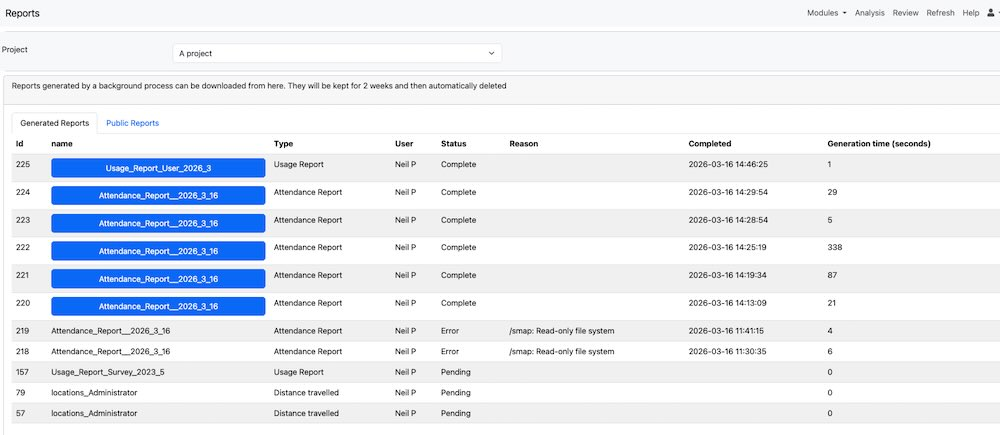

Reports
=======

To access reports, select **Modules** > **Reports**.

   Reports Page

There are two tabs on this page. One shows generated reports that are
available to download. The other shows public reports that can be accessed
by anyone who has the URL.

Generated Reports
-----------------

Some administrative reports take a while to run, so they are processed in
the background instead of downloading immediately. When a report is ready,
you can download it from this tab. Generated reports are kept for 2 weeks
before they are deleted automatically.

Public Reports
--------------
Public reports show data such as survey submissions. You can configure a
report with filters and time ranges, then run it whenever you need the
latest data.

Click **Add Report** to create a report. Supported report types are XLS and
PDF. Give the report a name so it is easy to identify.

To create and use a public report:

#. Click **Add Report**.
#. Select the report type and name it.
#. Configure filters and time range.
#. Save, then run the report.
#. Share the report URL if needed.

A key difference between reports and simple exports is that a report link
can be sent to someone who does not have an account on the system. They can
use the URL to download the latest data.

Reports can also be attached to periodic notifications. In this case, any
date range set in the report is ignored. The notification date range is
used instead.

From the report actions menu, you can run, edit, or delete a report.

Administrative Reports
----------------------

Administrative reports are available in various modules, for example the
admin module. If a report takes a long time to run, its output can be
downloaded later from the Reports module. Otherwise, data is shown
immediately after the report is requested.
