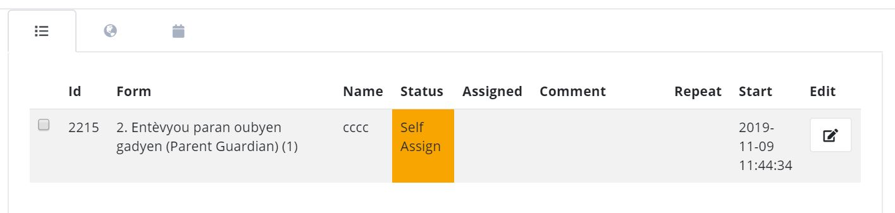

Self Assign
===========

If the option "Self Assign" is selected for a task then, if that task is currently unassigned, a user of FieldTask can assign themselves by doing a long
press on the task and selecting "Accept the task".

.. note::

  Self assign can be set directly on a task using the **Add Task / Edit Task** dialog.  Or it can be set in the task group which will
  cause all tasks automatically created in that task group to be set to "Self Assign".
  

   Self Assign Task
   
In FieldTask, self assigned tasks will appear with an orange icon. The user cannot directly complete the task by selecting it instead they can do
a long press on the task and either select:

*  "Reject Task" This will remove the task from their task list but it will still be available to other users
*  "Accept Task" This will convert the task into a regular assigned task, assigned to the user that selected it. Other users will no longer see the task
