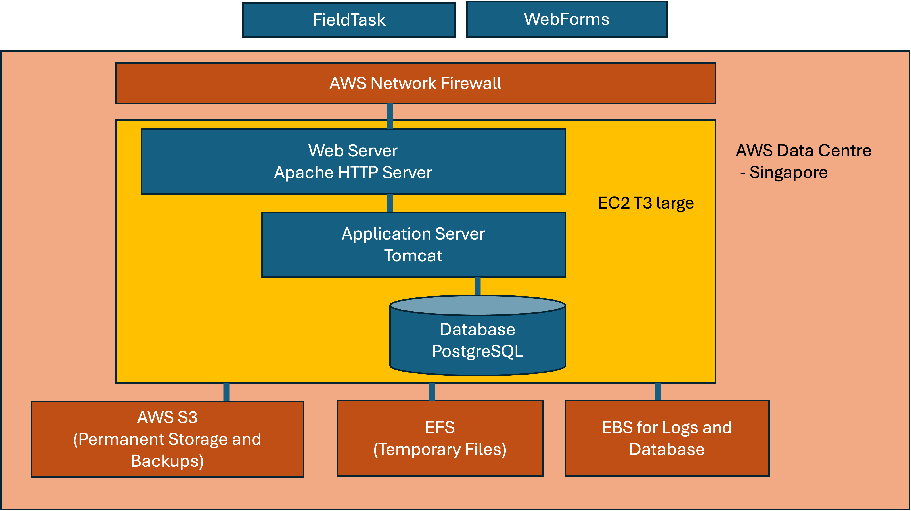

Hosted Server
=============

.. contents::
 :local:

Smap provides a free hosted server at https://sg.smap.com.au for use by individuals, not for profit organisations and any organisation
which is trying the system out.

Overview
--------

   Hosted Server

.. _hosted-security:

Security
--------

The following security controls are provided with the hosted server.  If you need higher levels of security it is recommended that you
install your own version of the server.

The server is located in a secure data centre managed by AWS and located in Singapore.

.. csv-table:: Network Firewall
  :header: open port, filtering

  22, Used for administration.  Only allows connections from a single IP address owned by Snap Consulting.  Logon requires a private certificate owned by Smap.
  80, Used by certbot for certificate renewal. Redirected to 443 by the web server
  443, All access to the system is via encrypted HTTP

All other ports are blocked for inbound access.

.. csv-table:: Encryption and firewalls
  :header: control, done, comment

  Encryption of network data,  Yes, All connections are encrypted. Attempts to connect as HTTP are redirected to HTTPS.
  Encryption of backups, Yes,  Backups are encrypted using PGP.
  Encryption of the database, No,  The database is not encrypted.
  Network Firewall, Yes, AWS network firewall
  Application Firewall, Yes, Apache modsecurity

.. csv-table:: Integrity Processes
  :header: control, done, comment

  Intrusion Detection,  No,
  Virus Checking, No

.. csv-table:: Service Levels
  :header: control, done, comment

  Availability,  , We will attempt to make the server available continously (24X7).  There are no planned outages, although these may happen.  In addition server faults may occur randomly and we will attempt to restart the server as soon as possible afterwards.
  Backup Recovery Point, 24 hours,  If there is a catastrophic failure of the server then it will be restored from offsite backups.  These backups are moved off site once every 24 hours.  So it is possible that the site will be restored to its state up to 24 hours previously.

.. csv-table:: Privacy
  :header: control, done, comment

  Privacy Policy,  , https://www.smap.com.au/privacy.shtml

.. _hosted-backups:

Storage and Backups
-------------------

The database uses EBS attached disk which has the log files as well as the operating system.  Logs are rotated and then compressed.
The result is that this usage grows relatively slowly.

Submitted raw XML files as well as attached media are stored temporarily on an expandable network file system.  Expandable because this can
grow quickly if a lot of large images are submitted.  After processing these files are moved to S3 storage which is substantially lower cost.

Backups and media are stored on S3.  This means that when the user requests to view an image it is served directly by S3.  The S3 bucket is
configured to only respond to requests originating from the SG public server.
