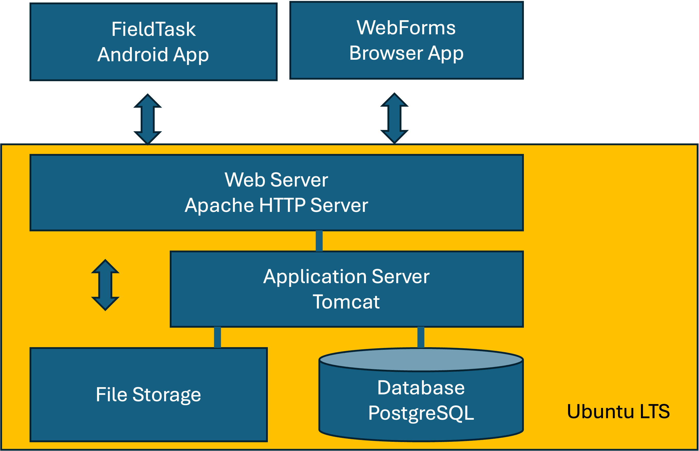
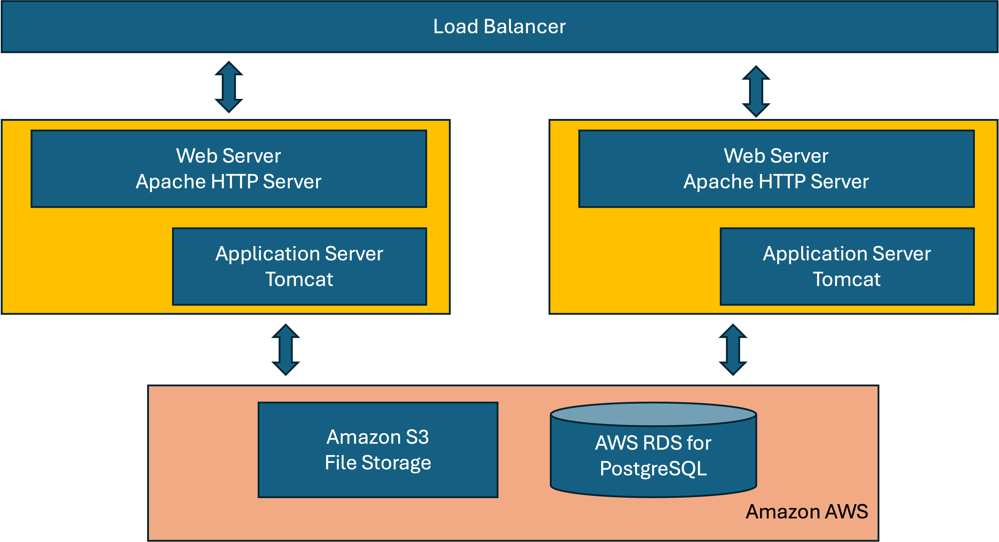

Deployment Configurations
=========================

.. contents::
 :local:

Small
-----

   Small Single Server

The minimum server configuration is:

* 1 CPU
* 2GB memory
* 10GB Disk

Almost certainly you will need more disk for a production system especially if you are capturing images and video.  However
apart from the disk, for most organisations, using Smap for M&E, this small server will be adequate.

In postgresql.conf::

  Max connections:  400

In /var/lib/tomcat[x]/conf/context.xml::

  MaxActive for survey_definitions and results resources:  60

In /etc/default/tomcat[x]::

  JAVA_OPTS="-Djava.awt.headless=true -Xms512m -Xmx768m"

For Ubuntu 24.04+ update setenv.sh in /usr/share/tomcat9/bin to include::

    export JAVA_OPTS="-Djava.awt.headless=true -Xms512m -Xmx768m"

Medium
------

A common vertical scaling of the server adds an additional CPU and more memory::

* 2 CPUs
* 4GB memory
* 100GB Disk

You can keep applying this vertical scaling as required however at some point you will find that you better performance by putting
the database on a separate server and higher availability by using multiple application servers with a load balancer.  This approach
is covered in the large configuration below.

In postgresql.conf::

  Max connections:  600

In /var/lib/tomcat[x]/conf/context.xml::

  MaxActive for survey_definitions and results resources:  100

In /etc/default/tomcat[x] or setenv.sh(for Ubuntu 24.04+)::

  JAVA_OPTS="-Djava.awt.headless=true -Xms2048m -Xmx2048m"

Large
-----

   A large configuration

The actual configuration, the number of servers their size etc can vary according to your needs.  The diagram shows use of
AWS S3 for storage and an AWS RDS database.  However other installations use Azure Blog for storage.

Configuring for a remote database
---------------------------------

#.  Add "export DBHOST={remote database address}" to /etc/environment
#.  Find the "context.xml" file for tomcat.  It should be at /etc/tomcat[version]/context.xml or at /var/lib/tomcat9/conf/context.xml.
    Then set the URL for the 2 datasources to match the URL of
    your remote database
#.  Rerun deploy.sh

Sample /etc/environment::

  export DBHOST=remote_db_server.myorg.com

Sample url for resource in context.xml::

  url="jdbc:postgresql://remote_db_server.myorg.com:5432/survey_definitions"

Configuring a second application server
---------------------------------------

If you are using a remote database you can add additional application servers for redundancy and performance.  However currently only one of these can
run the subscriber batch job that applies submissions to the database.  Otherwise a lot of false update errors will be reported as multiple subscribers
clash.

Hence in all but one of your application servers specify in /etc/environment::

  SUBSCRIBER=no

This should be specified before you install Smap into the new application server.