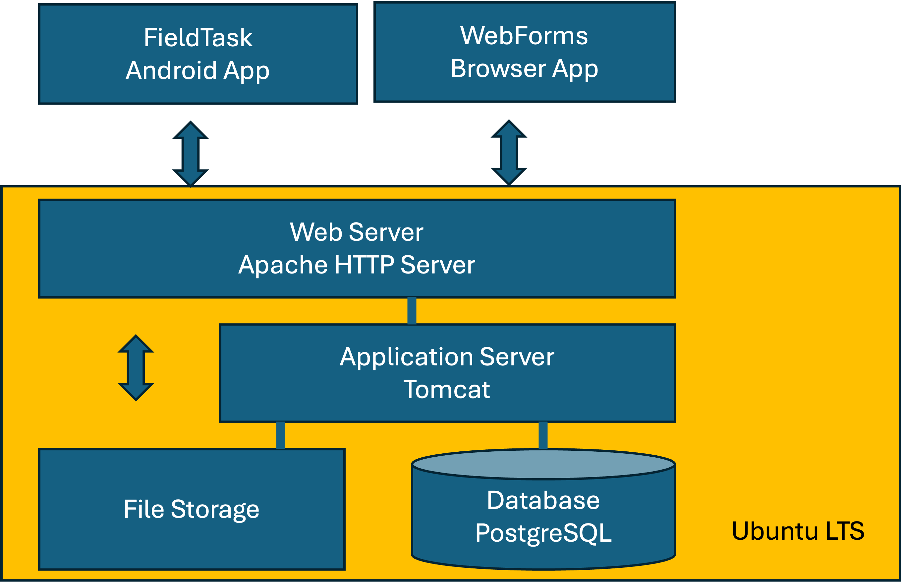
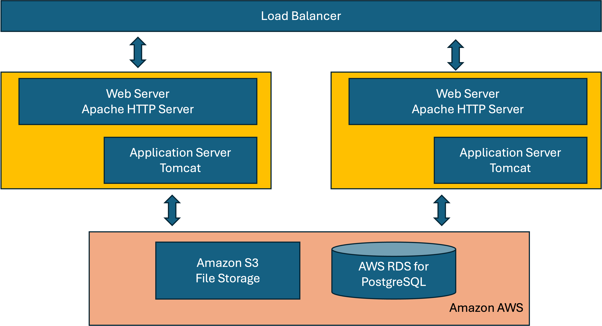

Server requirements
===================

.. contents::
 :local:

The install script and infrastructure components support the following base
platform requirements:

* One of the following Ubuntu LTS Server versions

  * 24.04
  * 22.04
  * 20.04
  * 18.04

* 2GB memory (minimum)
* 10GB disk (minimum)
* Chip architecture: X86 or Arm

For production systems, disk requirements are usually much higher, especially
when capturing images and video.

Small
-----

   Small single server

The minimum server configuration is:

* 1 CPU
* 2GB memory
* 10GB disk

You will almost certainly need more disk for a production system, especially
if you are capturing images and video. Apart from disk, this small server is
adequate for most organisations using Smap for M&E.

In postgresql.conf::

  Max connections:  400

In /var/lib/tomcat[x]/conf/context.xml::

  MaxActive for survey_definitions and results resources:  60

In /etc/default/tomcat[x]::

  JAVA_OPTS="-Djava.awt.headless=true -Xms512m -Xmx768m"

For Ubuntu 24.04+, update ``setenv.sh`` in ``/usr/share/tomcat9/bin`` to
include::

    export JAVA_OPTS="-Djava.awt.headless=true -Xms512m -Xmx768m"

Medium
------

A common vertical scaling step is to add one CPU and more memory::

* 2 CPUs
* 4GB memory
* 100GB disk

You can keep applying this vertical scaling as required. However, at some
point, performance is usually better with the database on a separate server,
and availability is higher with multiple application servers behind a load
balancer. This approach is covered in the large configuration below.

In postgresql.conf::

  Max connections:  600

In /var/lib/tomcat[x]/conf/context.xml::

  MaxActive for survey_definitions and results resources:  100

In /etc/default/tomcat[x] or ``setenv.sh`` (for Ubuntu 24.04+)::

  JAVA_OPTS="-Djava.awt.headless=true -Xms2048m -Xmx2048m"

Large
-----

   A large configuration

The actual configuration (number of servers, server size, and storage choice)
varies by deployment. The diagram shows AWS S3 for storage and AWS RDS for the
database. Other installations use Azure Blob Storage.

If you are vertically scaling to a large single server (8GB RAM baseline), use
the following starting settings. For a multi-server large deployment, apply
these values per application server (8GB RAM per server).

In postgresql.conf::

  Max connections:  800

In /var/lib/tomcat[x]/conf/context.xml::

  MaxActive for survey_definitions and results resources:  120

In /etc/default/tomcat[x] or ``setenv.sh`` (for Ubuntu 24.04+)::

  JAVA_OPTS="-Djava.awt.headless=true -Xms4096m -Xmx4096m"

Configuring for a remote database
---------------------------------

#. Add ``export DBHOST={remote database address}`` to ``/etc/environment``.
#. Find Tomcat's ``context.xml`` file. It should be at
   ``/etc/tomcat[version]/context.xml`` or
   ``/var/lib/tomcat9/conf/context.xml``. Set the URL for both data sources to
   match your remote database.
#. Re-run ``deploy.sh``.

Sample /etc/environment::

  export DBHOST=remote_db_server.myorg.com

Sample URL for a resource in ``context.xml``::

  url="jdbc:postgresql://remote_db_server.myorg.com:5432/survey_definitions"

Configuring a second application server
---------------------------------------

If you are using a remote database, you can add additional application servers
for redundancy and performance. However, currently only one server can run the
subscriber batch job that applies submissions to the database. Otherwise, many
false update errors will be reported when multiple subscribers clash.

For all but one application server, set this in ``/etc/environment``::

  SUBSCRIBER=no

Set this before installing Smap on the new application server.

Apache2 configuration
---------------------

Apache uses the ``mpm_event`` module. Its configuration is in
``/etc/apache2/mods-available/mpm_event.conf``. Modify as required, then
restart Apache2. The most important parameter is usually
**MaxRequestWorkers**.

Example mpm_event.conf file for a high volume server::

    StartServers            4
    ServerLimit             30
    MinSpareThreads         50
    MaxSpareThreads         75
    ThreadLimit             64
    ThreadsPerChild         25
    MaxRequestWorkers       600
    MaxConnectionsPerChild  0

Tomcat configuration
--------------------
