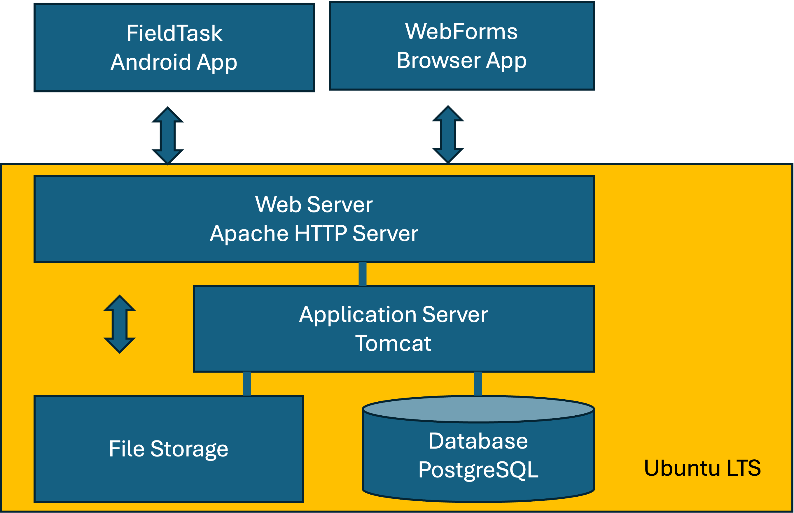
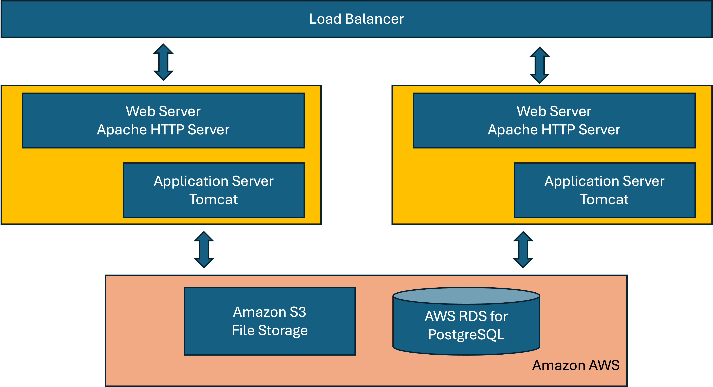

Server requirements
===================

.. contents::
 :local:

The install script and infrastructure components support the following base
platform requirements:

* One of the following Ubuntu LTS Server versions

  * 26.04
  * 24.04
  * 22.04

* 2GB memory (minimum)
* 10GB disk (minimum)
* Chip architecture: X86 or Arm

For production systems, disk requirements are usually much higher, especially
when capturing images and video.

Small
-----

   Small single server

The minimum server configuration is:

* 1 CPU
* 2GB memory
* 10GB disk

You will almost certainly need more disk for a production system, especially
if you are capturing images and video. Apart from disk, this small server is
adequate for most organisations using Smap for M&E.

In ``postgresql.conf``::

  max_connections = 400

In Tomcat's ``context.xml``, on both the ``jdbc/survey_definitions`` and
``jdbc/results`` resources::

  maxActive="60"

Java heap for Tomcat::

  JAVA_OPTS="-Djava.awt.headless=true -Xms512m -Xmx768m"

Where each of these files lives, and where ``JAVA_OPTS`` has to be set, depends
on how Tomcat was installed. See :ref:`tomcat-config`.

Medium
------

A common vertical scaling step is to add one CPU and more memory:

* 2 CPUs
* 4GB memory
* 100GB disk

You can keep applying this vertical scaling as required. However, at some
point, performance is usually better with the database on a separate server,
and availability is higher with multiple application servers behind a load
balancer. This approach is covered in the large configuration below.

In ``postgresql.conf``::

  max_connections = 600

In Tomcat's ``context.xml``, on both the ``jdbc/survey_definitions`` and
``jdbc/results`` resources::

  maxActive="100"

Java heap for Tomcat (see :ref:`tomcat-config`)::

  JAVA_OPTS="-Djava.awt.headless=true -Xms2048m -Xmx2048m"

Large
-----

   A large configuration

The actual configuration (number of servers, server size, and storage choice)
varies by deployment. The diagram shows AWS S3 for storage and AWS RDS for the
database. Other installations use Azure Blob Storage.

If you are vertically scaling to a large single server (8GB RAM baseline), use
the following starting settings. For a multi-server large deployment, apply
these values per application server (8GB RAM per server).

In ``postgresql.conf``::

  max_connections = 800

In Tomcat's ``context.xml``, on both the ``jdbc/survey_definitions`` and
``jdbc/results`` resources::

  maxActive="120"

Java heap for Tomcat (see :ref:`tomcat-config`)::

  JAVA_OPTS="-Djava.awt.headless=true -Xms4096m -Xmx4096m"

With more than one application server, every server opens its own pools, so
check the total against ``max_connections`` as described in
:ref:`tomcat-config`.

Loading large reference data files
----------------------------------

Requires SmapServer v26.09

Shared resource CSV files, including data synchronised from SharePoint and DHIS2, are loaded
into the database a batch at a time inside a single transaction.  A load that fails part way
therefore leaves the previous data in place, rather than a partly filled table that lookups
would quietly read as though it were complete.

Batched inserts are considerably faster when the PostgreSQL driver is allowed to combine them.
Add ``reWriteBatchedInserts=true`` to the URL of both data sources in ``context.xml``
(see :ref:`tomcat-config` for its location)::

  url="jdbc:postgresql://127.0.0.1:5432/survey_definitions?reWriteBatchedInserts=true"
  url="jdbc:postgresql://127.0.0.1:5432/results?reWriteBatchedInserts=true"

New installations pick this up automatically.  **Existing servers need it added by hand**, as
``context.xml`` is not replaced by an upgrade.  Loading works without it, only more slowly.

Configuring for a remote database
---------------------------------

#. Add ``export DBHOST={remote database address}`` to ``/etc/environment``.
#. Find Tomcat's ``context.xml`` file: ``/etc/tomcat10/context.xml`` on a
   packaged install, ``/var/lib/tomcat10/conf/context.xml`` on a manual
   install (see :ref:`tomcat-config`). Set the URL for both data sources to
   match your remote database.
#. Re-run ``deploy.sh``.

Sample /etc/environment::

  export DBHOST=remote_db_server.myorg.com

Sample URL for a resource in ``context.xml``::

  url="jdbc:postgresql://remote_db_server.myorg.com:5432/survey_definitions"

Configuring a second application server
---------------------------------------

If you are using a remote database, you can add additional application servers
for redundancy and performance. However, currently only one server can run the
subscriber batch job that applies submissions to the database. Otherwise, many
false update errors will be reported when multiple subscribers clash.

For all but one application server, set this in ``/etc/environment``::

  SUBSCRIBER=no

Set this before installing Smap on the new application server.

Apache2 configuration
---------------------

Apache uses the ``mpm_event`` module. Its configuration is in
``/etc/apache2/mods-available/mpm_event.conf``. Modify as required, then
restart Apache2. The most important parameter is usually
**MaxRequestWorkers**.

Example mpm_event.conf file for a high volume server::

    StartServers            4
    ServerLimit             30
    MinSpareThreads         50
    MaxSpareThreads         75
    ThreadLimit             64
    ThreadsPerChild         25
    MaxRequestWorkers       600
    MaxConnectionsPerChild  0

.. _tomcat-config:

Tomcat configuration
--------------------

Two types of Tomcat deployment
++++++++++++++++++++++++++++++

Smap runs on Tomcat 10, but it is installed in one of two different ways
depending on the Ubuntu version. The two layouts keep their files in different
places, and a setting that works on one has no effect on the other, so check
which one you have before changing anything.

.. list-table::
   :header-rows: 1
   :widths: 22 39 39

   * -
     - Packaged install
     - Manual install
   * - Ubuntu version
     - 26.04
     - 24.04 and 22.04
   * - Installed by
     - ``apt-get install tomcat10``
     - Apache tarball unpacked by ``install.sh``
   * - Configuration files
     - ``/etc/tomcat10``
     - ``/var/lib/tomcat10/conf``
   * - Web applications
     - ``/var/lib/tomcat10/webapps``
     - ``/var/lib/tomcat10/webapps``
   * - systemd unit
     - shipped with the package
     - installed by Smap from ``config_files/tomcat10.service``
   * - Java options
     - ``/etc/default/tomcat10``
     - ``/var/lib/tomcat10/bin/setenv.sh``

To tell them apart on a running server::

  systemctl cat tomcat10 | grep -E "ExecStart|EnvironmentFile"

``ExecStart=/var/lib/tomcat10/bin/startup.sh`` is the manual install. An
``ExecStart`` that runs a packaged start script, together with an
``EnvironmentFile`` of ``/etc/default/tomcat10``, is the packaged install.

Setting the Java heap
+++++++++++++++++++++

The heap sizes given in the Small, Medium and Large sections above are set
through ``JAVA_OPTS``, but the file that holds it differs.

**Packaged install.** Edit ``/etc/default/tomcat10``::

  JAVA_OPTS="-Djava.awt.headless=true -Xms2048m -Xmx2048m"

**Manual install.** ``/etc/default/tomcat10`` does not exist and is ignored.
``catalina.sh`` instead reads ``bin/setenv.sh``, which is **not** created by
the installer, so create it yourself::

  sudo tee /var/lib/tomcat10/bin/setenv.sh <<'EOF'
  export JAVA_OPTS="-Djava.awt.headless=true -Xms2048m -Xmx2048m"
  EOF
  sudo chown tomcat:tomcat /var/lib/tomcat10/bin/setenv.sh
  sudo chmod 755 /var/lib/tomcat10/bin/setenv.sh

``setenv.sh`` is sourced after the systemd unit has set its own ``JAVA_OPTS``
and replaces it, so always include ``-Djava.awt.headless=true`` in the value
you set. PDF and image generation fail without it.

.. warning::
   Nothing in the install or deploy scripts creates ``setenv.sh``, and a server
   migrated from Tomcat 9 gets a completely fresh ``/var/lib/tomcat10`` with
   only ``server.xml`` and ``context.xml`` carried across. Any ``setenv.sh``
   from the old Tomcat 9 tree is left behind, so the heap silently drops back
   to the JVM default. Recreate the file after migrating.

``patchdb.sh`` appends the AWS credentials line
(``. /smap_bin/setcredentials.sh``) to ``setenv.sh`` during a deploy, but only
if the file already exists. If you use AWS services from Tomcat on a manual
install, the file has to be there.

Restart Tomcat and confirm the setting took effect::

  sudo systemctl restart tomcat10
  ps -o args= -p $(pgrep -f org.apache.catalina.startup.Bootstrap) | tr ' ' '\n' | grep -E "^-Xm"

Do not put local settings in
``/etc/systemd/system/tomcat10.service.d/override.conf``. Smap owns that file
and overwrites it on every deploy.

Database connection pools
+++++++++++++++++++++++++

Both data sources are defined in ``context.xml`` and use the Tomcat JDBC pool
(``org.apache.tomcat.jdbc.pool.DataSourceFactory``), so the size attribute is
``maxActive``. Note that this is not the same as ``maxTotal``, which is the
equivalent attribute in the DBCP2 pool used in other examples on the web.

Each application server can therefore hold up to ``2 x maxActive`` connections
open, one pool for ``survey_definitions`` and one for ``results``. Keep
PostgreSQL ``max_connections`` comfortably above::

  (number of application servers) x 2 x maxActive
    + connections used by the subscribers
    + headroom for psql, backups and monitoring

The pools are configured with ``maxWait="-1"``, which means a request waits
indefinitely for a free connection instead of failing. A pool that is too small
shows up as pages that hang under load rather than as errors in the log.

.. note::
   ``context.xml`` holds the database user name and password, so it is never
   replaced by an upgrade. Your edits are safe, but new settings released with
   a version of Smap have to be added by hand.

AJP connector
+++++++++++++

Apache proxies to Tomcat over AJP on port 8009, configured by the connector in
``server.xml``. The connector does not set ``maxThreads``, so it uses the
Tomcat default of 200 request threads. If Apache **MaxRequestWorkers** is set
much above that and most of those requests are proxied through to Tomcat, add a
matching ``maxThreads`` to the connector::

  <Connector port="8009" protocol="AJP/1.3"
      maxThreads="400"
      enableLookups="false"
      tomcatAuthentication="false"
      disableUploadTimeout="false"
      connectionUploadTimeout="36000000"
      connectionTimeout="600000"
      secretRequired="false"
      />

Each busy request thread can hold a database connection, so raising
``maxThreads`` without also reviewing ``maxActive`` and ``max_connections``
just moves the queue.

.. warning::
   Unlike ``context.xml``, ``server.xml`` **is** overwritten on every deploy
   from ``config_files/server.xml.tomcat10``. Keep a copy of any local change
   and reapply it after upgrading, or better, get the change into the Smap
   source file.

After editing either file, restart Tomcat::

  sudo systemctl restart tomcat10
