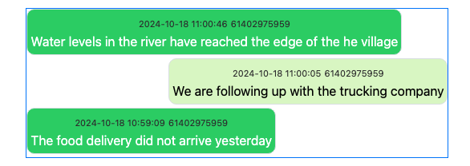

.. _sms-server-admin:

Set up SMS Numbers
==================

.. contents::
 :local:

SMS messages can create a new case and within that case you can converse with the original sender of the SMS.  Currently this feature
is only supported using the Vonage platform.  Once you have a number Smap can be configured to use it.  Details can be found here: (:ref:`sms`).
Documentation on how to use SMS messages as part of case management can be found here: (:ref:`sms_case`).

Requires Smap Server version 24.09+.

Vonage
------

#.  Create an account on Vonage, https://www.vonage.com/
#.  Login to "Communication APIs"
#.  Select "Numbers" and purchase one or more numbers for inbound requests
#.  On the API Settings page, under SMS settings, select “Messages API” this API will support WhatsApp messages as well as SMS.
    Click save changes.
#.  On the applications page, create a new application

    #.  Enable messages
    #.  Specify the inbound URL as https://{your server}/sms/vonage/inbound
    #.  Specify the status URL as https://{your server}/sms/vonage/status
    #.  Press the next button
    #.  Link your number to this application
#.  If you select the application that you created then you will see the application id which you will need to enter into the
    server settings page on smap. (You will need server owner privilege to do this).
#.  Rename the private key created by Vonage to "vonage_private.key" and update your deployment scripts to
    place this in /smap_bin/resources/properties/ on the server.  If you place this file in the
    smap/deploy/version1/resources/properties folder in the deployed tar file then it will be automatically 
    copied to the correct location.
#.  You will also need to get a "Signature secret" from the API settings page so that you can use "signed web hooks" to receive SMS
    messages.  The server will check the
    secret included with each inbound request to verify that it has come from Vonage. Enter this secret into the server
    settings page on Smap.  (You will need server owner privilege to do this).

   Vonage Application Details Page showing the application ID (obscured)

   Vonage API Settings Page showing the web hook signature secret

Diagnosing Issues
-----------------

If SMS messages sent to your number are not arriving try the following steps to diagnose the problem:

#.  Look in the Smap application logs for errors.
#.  Look in the "Server" tab under the monitor page.  This will show incoming messages that are not associated with an organisation.
    If you have not connected your number to an organisation this is where the problem will become apparent.
#.  Check the Apache error log at /var/log/apache/error.log.  If you have not set up the web hook signature secret you will see
    authentication error messages.
#.  Look in the Apache access log at /var/log/apache/access.log.  You may see 403 responses which indicates that the access was forbidden by
    the server.
#.  Look in the Tomcat logs at /var/log/tomcat/catalina.out for more details and also to see exceptions reported.
#.  Check the Vonage logs for inbound SMS messages to make sure the SMS is making it that far.

If SMS messages are not being sent try the above steps and also check:

#.  Check in monitoring page in the admin module.  Look under the notifications tab.
#.  The subscriber logs at /var/log/subscribers