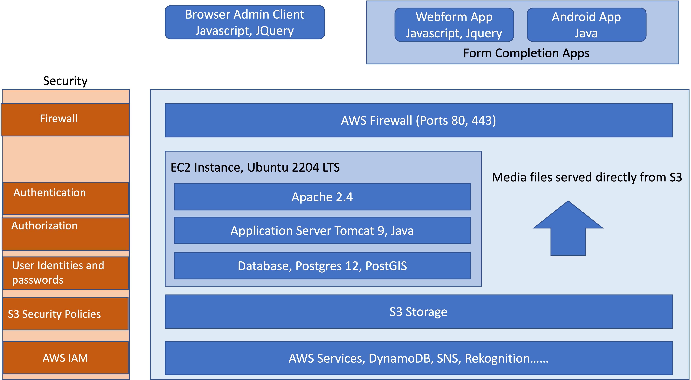

System Overview
===============

.. contents::
 :local:

   System Overview

Firewall
--------

Servers hosted by Smap are located in AWS data centres behind an Amazon Network firewall.  Three ports are opened:
*  443:  All access to the system is via encrypted HTTP
*  80:   Used by certbot for certificate renewal.  The webserver redirects application requests on port 80 to 443
*  22:   Used for administration.  A private key certificate is required to logon. Generally network access is also restricted to those machines used for administration.

Server
------

The system requires a linux server.  In addition scripts are tuned and tested only for Ubuntu LTS servers.

Web Server
----------

Users are authenticated in the Apache web server prior to accessing the application server.

Application Server
------------------

Authorisation is performed in the Tomcat Application Server.

Database
--------

All data, with the exception of media, is stored in a PostgreSQL database with GIS extensions.

File Storage
------------

In small installations media files are stored on the hard disk.   However for larger installations they are stored in AWS S3,  (or equivalent), and
served directly by the web server from S3.

AWS Services
------------

Access to services such as Rekognition is controlled using AWS IAM.  The services used are:

*  Rekognition.  To identify objects in images.
*  Transcribe.  Convert speech to text.
*  Translate.  Translate text into other natural languages.
*  Comprehend. Sentiment analysis.
*  DynamoDB.  To manage notifications to android apps.