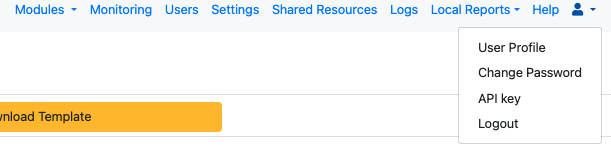

.. _apis:

Server APIs
===========

The APIs consist of REST web services, although they are not a strict REST implementation.   Most return JSON or GeoJson.  Many also accept
a query parameter of links=true.  This allows the API calls to be browsed from web browser, especially if you have a JSON formatter installed. A good place
to start would be  `https://sg.smap.com.au/api/v1/admin/projects?links=true <https://sg.smap.com.au/api/v1/admin/projects?links=true>`_
This will return the projects that you have access to and links to get more data  related to each project.

Authentication
--------------

There are 2 versions of the API:

*  /api/v1  - Uses Basic Authentication
*  /api/v2  - Uses an API key

Version 2
+++++++++

Version 2 is available with Smap Server version 24.05.  The API key can be found by selecting the user profile menu option which
has the head and shoulders icon.

   API Key menu item

Then select the menu item "API Key" and then "Create API key".  The generated key should then be copied and added as a
header called "x-api-key" in your API request.

You can replace the API key at any time.  Only one key can be active at a time so API requests will start to fail if you replace or
delete a key without updating the headers on your requests.

Not all V1 API entry points may have also been converted to V2.  If V2 is supported it will be mentioned in the documentation.

Using POST
----------

When sending data to the server using a POST request:

*  Set the "Content-Type" in the header to "application/x-www-form-urlencoded"
*  Set the body of the request to be "x-www-form-urlencoded"

.. toctree::
  :maxdepth: 1
  
  data-api.rst
  admin-api.rst
  audit-api.rst
  tasks-api.rst
  users-api.rst
  log-api.rst
  contacts-api.rst
  campaign-api.rst
  owner-api.rst
