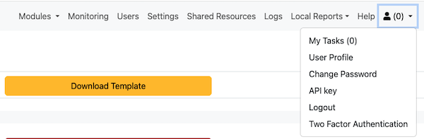
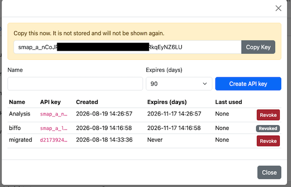

.. _apis:

Server APIs
===========

The APIs consist of REST web services, although they are not a strict REST implementation.   Most return JSON or GeoJson.  Many also accept
a query parameter of links=true.  This allows the API calls to be browsed from web browser, especially if you have a JSON formatter installed. A good place
to start would be  `https://sg.smap.com.au/api/v1/admin/projects?links=true <https://sg.smap.com.au/api/v1/admin/projects?links=true>`_
This will return the projects that you have access to and links to get more data  related to each project.

Authentication
--------------

There are 2 versions of the API:

*  /api/v1  - Uses Basic Authentication
*  /api/v2  - Uses an API key

Version 2
+++++++++

Version 2 is available with Smap Server version 24.05.  API keys are managed from the user profile menu,
the one with the head and shoulders icon.

   API Key menu item

Select the menu item "API Key".  Give the key a name saying what it is for, choose how long it should last -
90 days, 365 days, or Never - and press "Create API key".  The key is displayed once, at that moment.  Copy it
straight away and send it as a header called "x-api-key" on your API requests.  The server keeps only a hash of
the key, so it cannot be shown again; a key that has been lost is replaced, not recovered.

   Creating an API key

From Smap Server version 26.08 you can hold several keys at once, each with its own expiry.  Give a separate
key to each program that calls the API, and you can withdraw one without disturbing the others.

The dialog lists the keys you already hold, showing the name, the first few characters of the key, when it was
created, when it expires and when it was last used, with a "Revoke" button against each.  Revoking takes effect
immediately.  An expired key stops working on its own, so a program using one starts getting 401 responses -
create a replacement and update the program's headers before the old key runs out.

   API Key Dialog

Not all V1 API entry points may have also been converted to V2.  If V2 is supported it will be mentioned in the documentation.

Using POST
----------

When sending data to the server using a POST request:

*  Set the "Content-Type" in the header to "application/x-www-form-urlencoded"
*  Set the body of the request to be "x-www-form-urlencoded"

.. toctree::
  :maxdepth: 1
  
  data-api.rst
  admin-api.rst
  audit-api.rst
  tasks-api.rst
  users-api.rst
  log-api.rst
  contacts-api.rst
  campaign-api.rst
  owner-api.rst
  notification-api.rst
