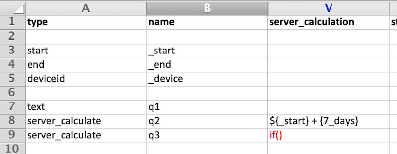
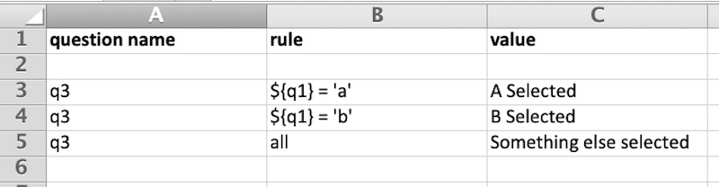

.. _server-calculations:

Server Calculations
===================

.. contents::
 :local:

Introduction
------------

Questions can be added to surveys where the answer is calculated on the server and not on the phone.   When creating reports or
viewing data in the console these calculations appear just like data that was entered in Weborms or on a mobile device.  An important
difference is that the calculation is performed when the data is viewed.  Hence if you change the expression used in the server 
calculation then the answer shown will change for all previously collected data.

.. note::

  You can also create calculation questions that are performed within a survey by specifying a question ot type "calculate".   
  This is useful if you are going to use the results of that calculation during the data collection process, perhaps in a 
  relevance. However it the calculation is only used during analysis you could consider server calculations.  Calculations
  performed in a survey are fixed once the data is submitted.  So if you update the survey to change the calculation the 
  values calculated for already collected data will not change.
  

Excel Editor
------------

In the Survey sheet specify

* type:  server_calculate
* name:  Specify a unique name name
* server_calculation:  Put the calculation here

Referring to Questions
----------------------

Use the same approach that is used for referring to questions in a relevance. That is surround
the question name with curly brackets and put a dollar sign in front.

Questions can be in any form. For example you may have a survey that gathers information on
comapanies and the projects that they are involved in. Hence the data on projects could be in a sub-form.
The following filter will trigger on a
company name of "Widgets" that has at least one project with a value over 100,000::

   ${company_name} = 'Widgets' and ${project_value} > 100000

It is currently not possible to aggregate data from sub-forms.

Supported Question Types
------------------------

* text
* integer
* decimal
* select_one
* barcode
* calculation
* date
* datetime
* acknowldege

Question types with minimal support
-----------------------------------

These question types can be used only to check to see if they were answered. 

* image
* audio
* video
* geopoint
* polygon
* line

For example::

  ${video_question} empty

Un-Supported Question Types
---------------------------

The following question types currently cannot be used to filter data

* select_multiple

Operators
---------

These are used for comparisons and to build up more complex expressions.  There must be a space each
both sides of these operators.

* = (equals)
* > (greater than)
* < (less than)
* >= (Greater than or equals)
* <= (Less than or equals)
* != (Not equals)
* not
* \- (minus)
* \+ (plus)
* \* (times)
* / (divide)
* and
* or
* like (Similar to.  Use the % symbol to match a range of characters.
  Use the _ underscore character to match a single character)
* not like (returns the rows that do not match)

Brackets
--------

Use smooth brackets for "association".  Like for operators these brackets must have spaces
around them.

* (
* )

Constants
---------

* integers written as is
* decimals written as is
* text values enclosed in single quotes
* date values enclosed in single quotes and in the following format yyyy-mm-dd.  Note
  that you need to enter two characters for months and days.

Date Formats
-------------

* 'yyyy-mm-dd'

Hence the thirty first of January, 2018 would be::  

  '2018-01-31'

Date Intervals
--------------

* {1_day}
* {n_days}
* {1_hour}
* {n_hours}
* {1_minute}
* {n_minutes}
* {1_second}
* {n_seconds}
* {hh:mm:ss}

Other
-----

* now()  (The current date and time)

Special Terms
-------------

* is null (Test to see if an answer was <b>not</b> given to a media or geopoint question)
* is not null (Test to see if an answer was given to a media or geopoint question)
* _upload_time (The date that the survey was uploaded to the server)
* _start (The time the survey was started)
* _end (The time the survey ended)
* ${_hrk} (The generated unique key for the record)
* ${_device} (The device identifier that submitted the results)
* ${_user} (The logon identifier of the user that submitted the results)

If Function
-----------

One of the most important functions is if().  The excel editor adds additional support to make it easier to specify these.  Currently
the if() function for server calculates is not supported by the online editor.

In the server_calculate column of the survey sheet enter only:  if().  In the following example there are two server 
calculations the second of which is an if().

   if() Server Calculations
   
Then set the conditions and their values in the "conditions" sheet of the excel file.

   if() Conditions
   
In the above example the value of q3 will be set to 'A Selected' if the answer to q1 was 'A'; 'B Selected' if the answer to q1 was 'b'; and 
to 'Something else selected' in all other cases.  

Examples
--------

::

  * ${person_name} = 'Tom'
  * ${age} > 5
  * ${age} > 25 or ${name} = 'tom'
  * ${name} like 'sam%' 
 Matches "sam", "samuel", "sammy" etc

  * ${city} like '_erlin'
  Matches "Berlin", "berlin"

  * ${city} not like '%ich%'
  Matches anything that does not have "ich" in it 

Examples with brackets::

  * ${age} > 25 or ( ${name} = 'tom' and ${age} > 5 )
  
Examples using constants::

  * ${name} > 25
  * ${weight} < 0.5
  * ${name} = 'tom'
  * ${date_question} = '2016-04-23'
  
Period Examples::

  * ${_upload_time} > ( {allocated_time} + {2_days} )
  * ${_start} + {7_days}
  * ${_start} + {7_days} + {20_minutes} 
  * ${_start} + {23:23:23}
  * now() - ${_upload_time} < {2_days}
  
Special Terms Examples::

  * ${image} empty
  * _upload_time > '2017-01-23'
