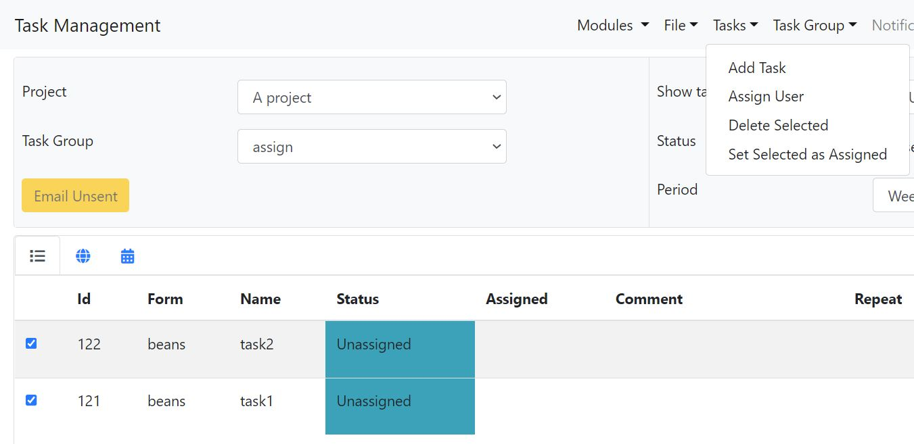

.. _bulk-changes-tasks:

Bulk changes to tasks
=====================

.. contents::
 :local:

1. select the checkbox to the left of each task that you want to change

.. figure::  _images/bulk_task1.jpg
   :align:   center
   :width:   400px
   :alt:     List of tassks showing two that have been selected for change

   Select tasks to change
   
   
2. select the bulk change option from the tasks menu

   
   Tasks menu selected

There are 3 options:

#.  Assign user.  Assign a user to all of the selected tasks
#.  Delete selected.  Delete the selected tasks.
#.  Set selected as assigned.  The task may have been marked as completed or rejected by a user using this option the task is marked as assigned back to the user so that they can recomplete it.
