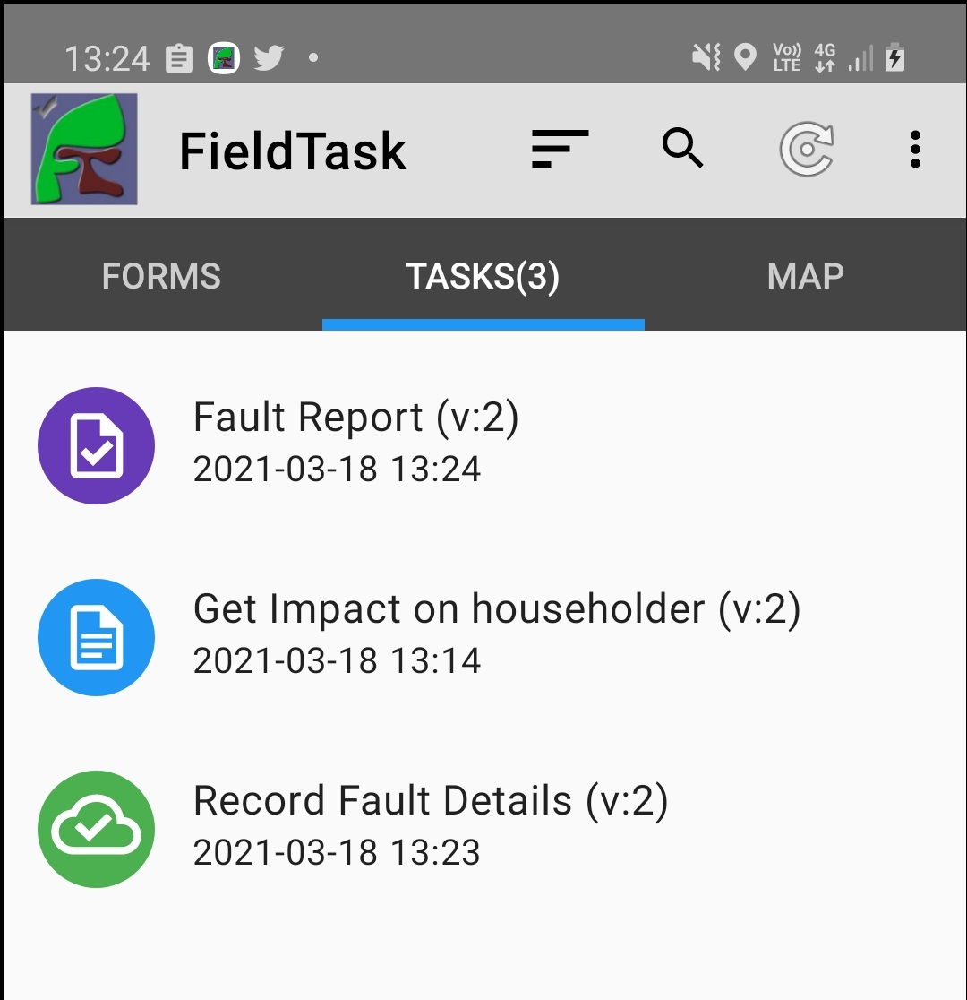
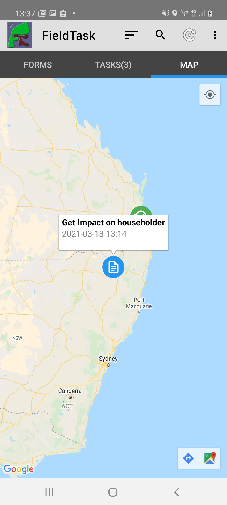

.. _tasks-fieldtask:

Completing tasks using FieldTask
================================

Tasks can be managed in FieldTask on the ``Tasks`` tab and, if the task has a location, then on the ``Map`` tab.  Completed and in-progress instances
of surveys are also shown on these tabs.  They can be considered as local tasks created by the device user when they open a survey.

Task States
-----------

Tasks in different states will be shown in a different color:

*  Rejected / Deleted:  Brown
*  Late:  Red
*  In progress: Blue
*  Submitted: Green
*  Finalised: Purple

   Task List Tab with 3 tasks in different states

Tasks will only enter the ``Late`` state if a target completion date has been specified.

Completing Tasks
----------------

Selecting the task in the task list or doing a long press on the task icon on the map will open the task for editing and completion.

Getting to the location of a task
---------------------------------

On the maps tab you can perform a short press on a task icon and a menu will appear that allows you to select google navigation to get to the task.

   Task map tab with a task selected and showing the navigation menu at bottom right

If you are working in an area where there is poor google maps coverage then you will not find this automatic navigation useful however you should be
able to get close to the location of the task by observing your location relative to it.
