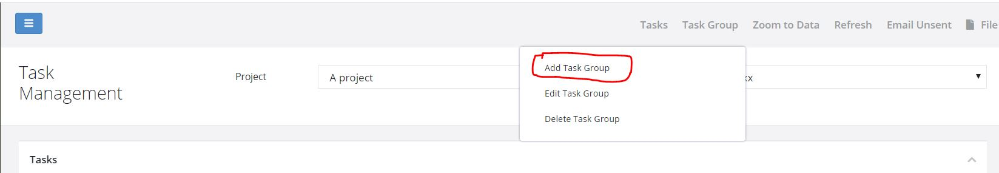
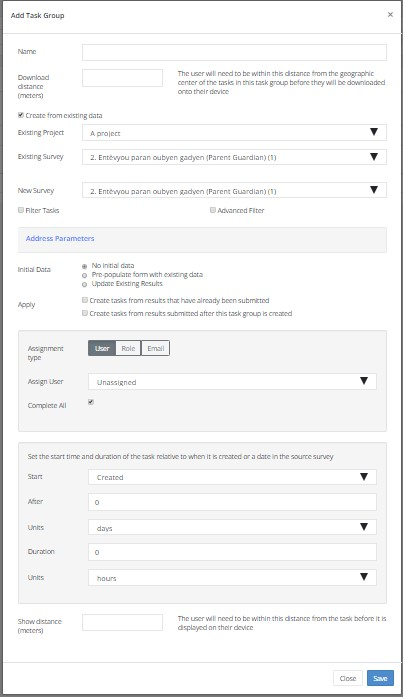

.. _task_groups:

Task Groups
===========

.. contents::
 :local:
 
Tasks are managed in task groups.   Task groups are placed inside projects hence surveys that can be assigned
have to be in the same project.  However the initial data for a task can come from a survey in a different project.

Task groups can be simple containers (Ad Hoc) in which you can create and manage tasks or they can have a **rule** that 
automatically creates tasks from submissions to a survey.  

Adding a Task Group
-------------------

   
   Adding a Task Group
   
Select the **Task Group menu** and then **Add Task Group**

The **task group name** is the only field that you have to complete. 

Download Distance
+++++++++++++++++

Optional field that applies to both **Ad Hoc** and **Automatic** tasks.  This can be used to only download tasks from the task group when 
the user is within the specified distance of the tasks.  This tasks location being the geographic center of all the tasks in the group.

*  When the user is within the specified distance and they press refresh then all the tasks in the group are downloaded
*  When the user moves outside of the specified distance and they press refresh then all the tasks in the group are removed from their device

A use for this might be if you have tasks that need to be completed in multiple, widely seperated, locations.  There is no point downloading
the tasks unless the user is close enough to complete them.  This is particularly the case if the number of tasks is large.  For example::

  A worker travelling to different cities with tasks to complete in each.

Ad Hoc Task Groups
------------------

If you press the save button without selecting the **Create from existing data** checkbox then an **Ad Hoc** task group
will be created. You can add tasks into this task group using the **tasks** menu.

Automatic Tasks
---------------

As for Ad Hoc tasks enter the task group name however then select the check box **Create from existing data**.

   
   Dialog for Automatic Tasks

Existing Project / Survey
+++++++++++++++++++++++++

The trigger for creating an automatic task will be submission of data to another survey.  This survey can be in a different project to the 
current one hence the project and survey of this trigger can be specified.

New Survey
++++++++++

This is the survey that will be launched to complete the task it has to be in the current project.

Filtering Tasks
++++++++++++++++

There are two checkboxes that you can select in order to filter out the submitted data that you want to trigger the new task.

*  Filter Tasks.  A simple filter.  Specify the question and the value in the existing survey data that will cause the new task to be created.
*  Advanced Filter. Specify the filter using :ref:`expression-reference`.

Address Parameters
++++++++++++++++++

Select questions from the existing survey.  Data from these questions will be used to create guidance for the person completing the task.  For 
example::

  Existing survey has "person_name" as a question
  Include this question as an address parameter
  The name of the person will be shown next to the task in FieldTask

Initial Data
++++++++++++

The questions in the new survey can be pre-populated with initial data.  There are 3 settings:

1.  No initial data.  A blank new survey will be completed as the task.
2.  Pre-populate with existing data.  Questions in the new survey with the same name as a question in the existing survey will be intialised
    with the exisiting data.  The new survey will create a new record.
3.  Update existing results. The new survey will be prepopulated with data from the existing survey however this time the existing record
    will be updated with data from the new survey.  For this option to be viable either the new and existing surveys must be the same or
    they must be in the same :ref:`survey_groups`

Apply
+++++

The rule that creates tasks from existing data can be applied to data that has already been submitted, data that is submitted after the 
task group is created or both.

Assignment
++++++++++

Tasks can be assigned to:

1.  An individual user
2.  Any user who has a specific security role
3.  Email addresses (comma separated)

For any of these assignment types the user, role or email addresses can be obtained from the existing record that triggered the creation of the task::

  In the hospital case management product a security role is created for each clinic location
  Users with the same role are then assigned follow up tasks such as consultation and dispensing pharmaceuticals

If assigned to an email address then the email recipient will receive a link to a webform that allows them to complete the task.  In this case
they do not need to have an account on the Smap server.

The **complete all** checkbox can be selected if you want all assigned users to complete the task.  Otherwise as soon as one user completes the
task then assignments to other users will be cancelled.

Start time and Duration
+++++++++++++++++++++++

The start time of the task is created from two inputs.
1.  A date/time which could be the date/time that the task was created or the answer to a date/time question in the existing survey
2.  Plus an interval after that date / time

For example the creation time of the task could be selected with an interval of 2 days.  The task will be created when a record is submitted to the
exisiting survey. So in this case the user will be requested to complete the new task 2 days after the existing survey is completed.

The duration of the task can also be specified in minutes, hours or days.

Show Distance
+++++++++++++

Similar to download distance but in this case the tasks are downloaded onto the users device but only shown if the user is within the specified number
of meters of the task.

Key differences with download tasks are:

*  Show distance works without a network connection as the tasks have already been downloaded.
*  A large number of tasks using show distance may make the app less responsive (100+ depending on the device specification)
*  Use Download distance if task groups are completed in discrete chunks

Email Options
+++++++++++++

If assignment is via email you can specify the subject and email body.  These can include references to questions in the existing survey using
the ${question_name} syntax.

Task Location
+++++++++++++

This cannot be set for a **Task Group**.  The GPS coordinates of a task are set from a location question in the source survey.  You can change this
by editing the individual task. 

Task Names
++++++++++

When creating tasks automatically a name is also automatically generated using the task group name, the project and the target survey.
