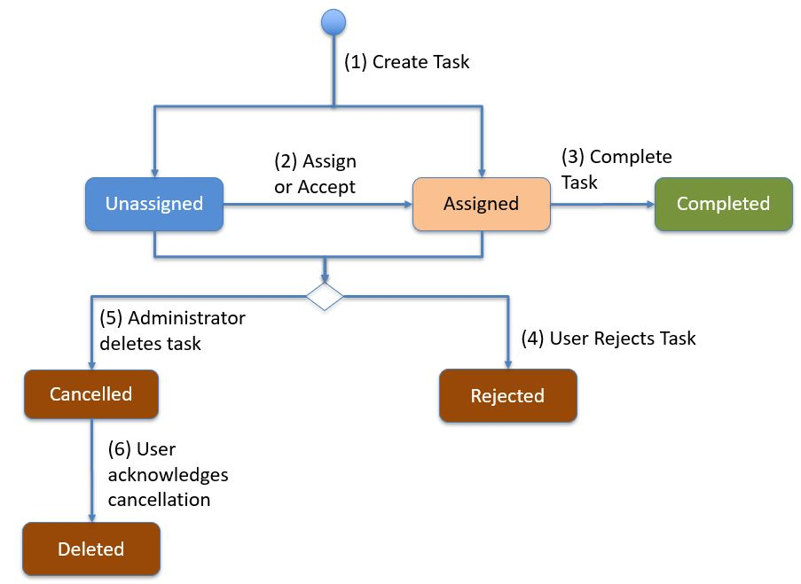
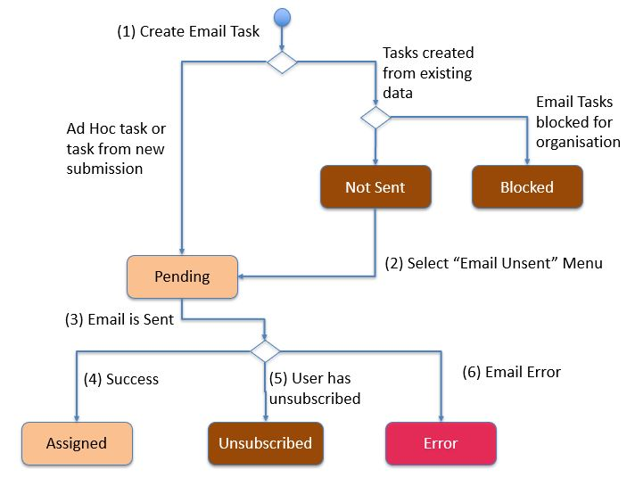

.. _task-lifecycle:

Task Lifecycle
==============

.. contents::
 :local:
 
Internal Tasks
--------------

These are tasks that are assigned to a user who has been setup on the system.  

   Internal Task Lifecycle
   
#.  **Create Task**.  An administrator creates a task or a task is created automatically in response to some event as per the
    rules in the task group.  The task can be initially assigned to a user or be unassigned.  
#.  **Assign or Accept**.  An administrator can assign a task to a user. (Or reassign it to a different user).  If the task
    is unassigned and "Self Assign" was selected, then FieldTask user can accept the task. I then changes to the **Assigned** state.
#.  **Complete**.  When the assigned user completes the task it goes into the **Completed** state.
#.  **Reject**.  A user can reject a task that has been assigned to them. If the task was not explicitely assigned to a user
    but the "Self Assign" checkbox was checked, then if the user rejects the task it stays in the unassigned state but will no
    longer appear in the users task list.
#.  **Cancel**.  An administrator can cancel a task.  FieldTask users will then see that task as cancelled. 
#.  **Acknowledge Cancel**.  The next time the FieldTask user refreshes their task list then any cancelled tasks will become
    deleted and no longer show in their task list.

.. note:

  An unassigned task is referred to as "new" in the :ref:`tasks-api`

Email Tasks
-----------

Email tasks can be assigned to anyone with an email address, they do not need an account on the system.  The life cycle is
similar to the lifecycle of internal task but there are some additional email specific steps shown below.

   Email Task Lifecycle

#. **Create Task**.  If the task is initally assigned to an email address then it becomes an email task.  It is not
   possible to have an unassigned email task.	

   *  If the task was an ad-hoc task or created from a new submission then it goes straight into pending state.

   *  However if the task was created from existing data then, because there could be a lot of tasks created, the administrator
      has to review the tasks before they are sent so they go into **Not Sent** state.

   *  If sending of email tasks is blocked for the organisation then the task will go into the **Blocked** state. 

#. If the tasks are in the **Not Sent** state the administrator can select the menu option "Email Unsent" to send them.

#. From the pending State emails are sent automatically.  If the email user has unsubscribed from email notifications then the 
   task will go into **Blocked** state.
	
#. Once the email has been successfully sent the task goes into the **Assigned** state.

Once an email task has entered the assigned state it can be completed by a user.  Email tasks can also be deleted at any
stage to enter the **Deleted** state.

Special Task States
-------------------

#.  **Late**.  An assigned task that is past its start by time in FieldTask will show as Late and be coloured red.  
    On the server the task will not be shown as late until after its scheduled end time (Assuming it is still assigned and not
    completed).
#.  **Self Assign**.  Tasks that are in the unassigned state but where the "Self Assign" checkbox has been checked, will be
    show as Self Assigned and be coloured orange.