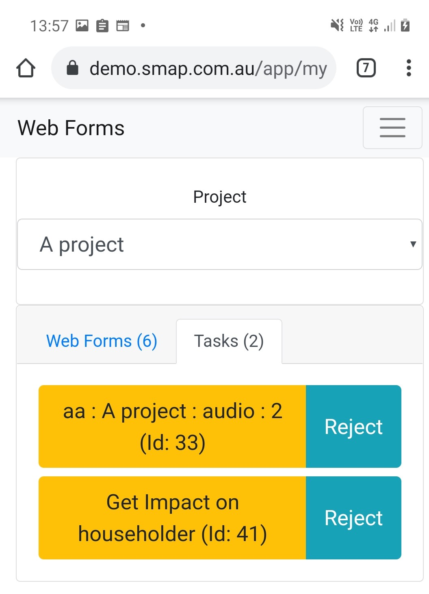

.. _tasks-webforms:

Completing tasks using WebForms
===============================

Tasks are shown in the ``Tasks`` tab on the webForms page of the server.

   Task Tab in web forms with two tasks displayed.

