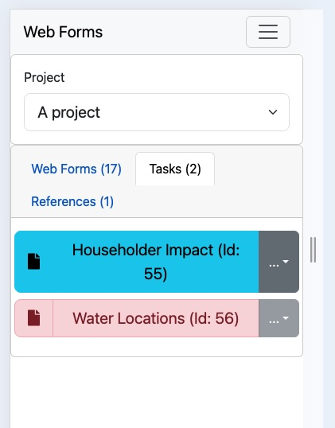

.. _tasks-webforms:

Completing tasks using WebForms
===============================

Tasks are shown in the ``Tasks`` tab on the webForms page of the server.

   Task Tab in web forms with two tasks displayed.

Click the task name to open it.  Use the "..." menu to **Accept** a task that has been offered to you or to **Reject**
one that you cannot do.  A rejected task is shown in red and can no longer be opened.

