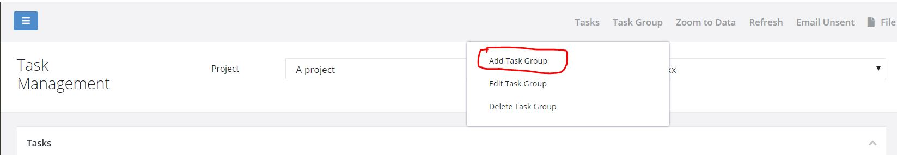

.. _tasks:

Tasks
=====

.. contents::
 :local:
 
To get to task select **Modules** and then **Tasks**.

Tasks can be assigned to a person in order to complete a blank survey or update an existing record.

Task Groups
-----------

Tasks are managed in task groups.   Task groups are placed inside projects hence surveys that can be assigned
have to be in the same project.  However the initial data for a task can come from a survey in a different project.

Task groups can be simple containers (Ad Hoc) in which you can create and manage tasks or they can have a **rule** that 
automatically creates tasks from submissions to a survey.  

Adding a Groups
---------------

   
   Adding a Task Group
   
Select the **Task Group menu** and then **Add Task Group**

Ad Hoc Task Groups
------------------

Enter the task group name and press the save button.  You can then add ad-hoc tasks into this task group.

Automatic Tasks
---------------

As for Ad Hoc tasks enter the task group name however then select the check box **Create from existing data**.

.. figure::  _images/tasks2.jpg
   :align:   center
   :alt: Dialog for Automatic Tasks
   
   Dialog for Automatic Tasks
