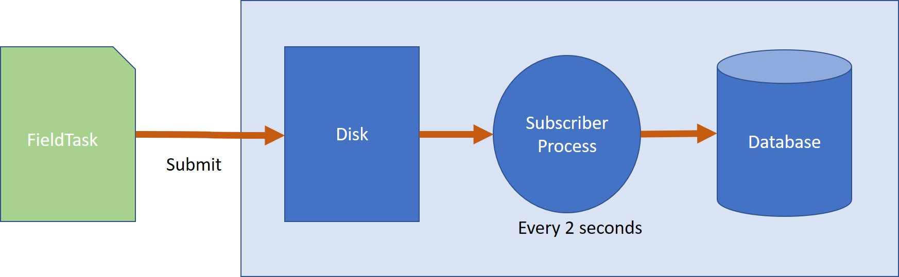

Sucessfully submitted data not appearing
========================================

.. contents::
 :local:

It can happen that enumerators refresh their phones and FieldTask reports that all of the data has been
successfully submitted however it is not appearing in exported results or the console.

Cause
-----

When FieldTask submits data to the server it is in a file (in XML format).  The server accepts this file,
writes it to the hard disk and tells FieldTask that all is good and FieldTask can now delete the data as it
has been received by the server.  Auto delete of subcessfully submitted data is an optional setting which is
recommended for security reasons.

However the above step was the easy part, next the data has to be applied to the database so that it can be viewed.
Every 2 seconds a background process starts and performs this step.  However if there is an error when writing the
database then the results will not appear.

   Submitting Results Process

Detecting the Problem
---------------------

*  The enumerators have submitted their data at least a minute ago and the results have not appeared
*  Open :ref:`admin_monitor` and look for errors or submissions that have not been uploaded

Resolution
----------

If submissions have not been uploaded then it is possible that the server is under heavy load with lots of submissions and your data
will appear if you just wait a few more minutes.  However it could also mean that the subscriber process has stopped and you will need
to contact technical support to restart it.

If errors are reported then there is a problem wiriting the data to the database.  The most common cause of this is a change to the survey
that changed a question type from integer to text or from text to date.   This 
article `article <http://blog.smap.com.au/hint-changing-the-question-after-you-have-started-collected-data/>`_ describes the problem and how to fix it.  
Although sometimes you will need to contact technical support to get the data loaded.
