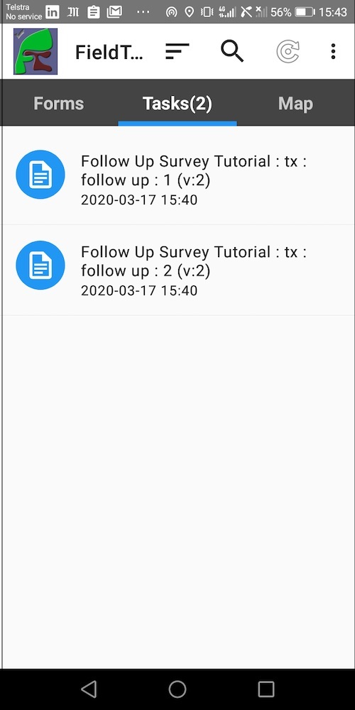
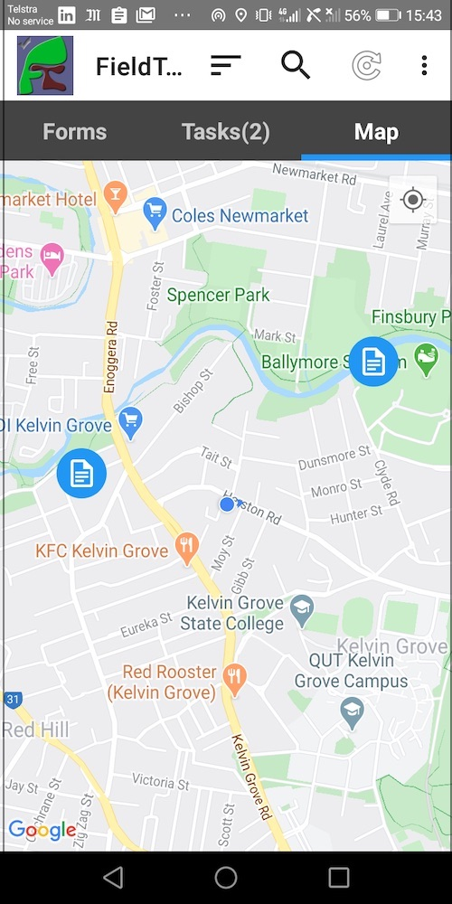

Follow up Survey
================

.. contents::
 :local:
 
Situatution
-----------

You may have conducted surveys and recorded the GPS coordinates of each location.  If you then want to do a follow up survey at those locations
you can create tasks for the data collectors based on the existing data.

Solution
--------

Lets assume your first survey is called "Initial" and it has the following two question (among many others)::

  select_one village "Village"
  geopoint location "Record Location"

.. note::

  We are going to use the village question to break up the tasks into groups so we can manage the follow up data collection easily.
  If you haven't got a convenient filter question like that you can assign the tasks to everyone or backup to a spreadsheet, add an arbitrary filter and
  import back in.

Secondly we will assume our second survey is called "Follow Up".

Create a Task Group
+++++++++++++++++++

*  Go to the tasks module by selecting **Modules** and then **Tasks** 
*  Select the **Task Group** menu and then **Add Task Group**
*  Give your task group a name (In our example an appropriate name might be the village)
*  Click on the checkbox "Create from Existing Data"
*  Select the survey called "Initial" as your existing survey
*  Select the survey "Follow Up" as the new survey
*  Click on filter tasks as we only want to add tasks for a single village to this group
*  Select "Filter By Question" and then select the Village question
*  In "Selected Option" select the village where you are going to do the follow up.
*  Optionally in Address Parameters select questions like "Householder Name". The answers to these questions will appear on the task and along with the
   GPS coordinates can guide the user to the correct location
*  Select the checkbox "Create tasks from results that have already been submitted"
*  Assign a user for this village.  You can only assign one user directly.  If you want to assign multiple then you can use roles. You can also edit the
   assigned users once you have created the task group.
*  Press the save button

You will see a list of tasks assigned to the user.  If you click on the "edit" button for one of the tasks you will see its location.  

   Tasks in a Task Group

The assigned user can now press "refresh on their phone.  If they can select the "Tasks" tab they will see their assigned tasks.

   Select task from list

If you selected **Address Parameters** you would see those values here in the list. However you will probably want to select the "Map" tab.

   Select task from map

The tasks will appear as blue round icons. Do a short press on a task to see its address parameters.  That will also cause a 
little menu to appear at bottom right allowing you to calculate a 
route using google maps. If you do a long press on the task in the map view it will open for completion.
   

The remaining villages
++++++++++++++++++++++

Create additional task groups for each village.

Comments
--------

This is a simple example of using tasks.  There are many more capabilities in the :ref:`tasks` module than covered here.

