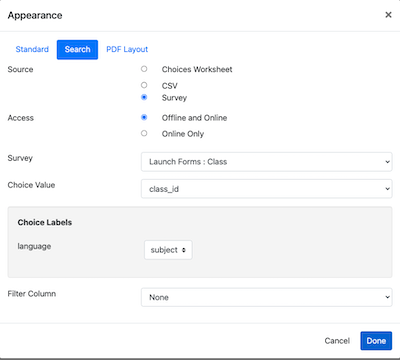
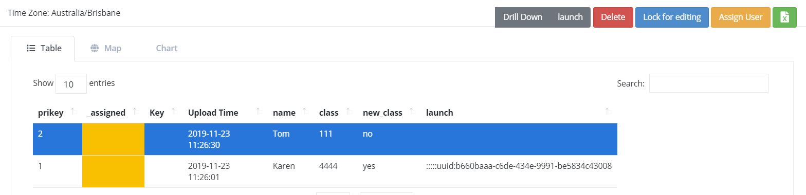
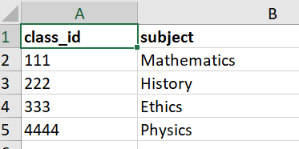
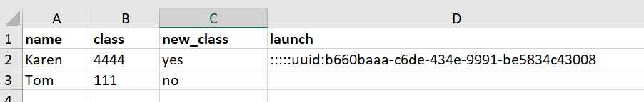

.. _launch-survey-tutorial:

Tutorial - Launching a Parent Survey
====================================

In this example the user will be filling out details on a pupil. When it comes to adding the class, if the class does not exist, then
they will launch the class form to add it and also to automatically add the pupil as being a member of that class.  All of these
instructions assume that you are using the online editor.

1. First create a survey called "Class". Add some questions including a text question called class_id. Edit the keys for this survey
   and set the key to "${class_id}" and the **Key Policy** to "merge".  **Keys**, for a survey, can be specified in the online editor by selecting the menu **Tools** and then
   **Bundle and Case Management** and then selecting the **Keys** tab.

2. Create a survey called "Pupil". Add some questions that you might want to record about the pupil such as their
   name.

3. Now in the Pupil form we are going to select the class attended by the pupil. Add a question called "class" of type select_one and specify that it
   get its choice list from the **Class** form. This is great, if there is an existing class the Pupil can be assigned to it. However if there is
   not an existing class then we want to launch a survey to create that task and automatically assign our pupil to it.

.. note::

  The online editor will guide you through getting a choice list from another survey. To do this edit the appearance for the select question
  and select the **search** tab.

   Specifying how to get the list of classes from the class survey

4. Create a question of type select_one and two choices "Yes" and "No", with a label "Is a new class needed?".

5. Add a question of type **parent_form**. Make it relevant only if a new class is needed. Edit the parameters to specify:

  *  Survey to launch: Set to "Class"
  *  Question to store the returned key: Set this to the question in the Pupil form also called "class".

Sample surveys as described above can be downloaded from:

*  `Finished class survey <https://docs.google.com/spreadsheets/d/1oh6oH9dM3-Kvs1-mN-J2GbOEBI19byId-d_YxXBFHU8/edit?usp=sharing>`_
*  `Finished pupil survey <https://docs.google.com/spreadsheets/d/1skiRy3WimY-rPZM8msjTZV93l-qmbxv8Sf7Wn-n4PuU/edit?usp=sharing>`_

Testing
+++++++

*  Complete the **Class** survey a couple of times to add some classes.
*  Complete the **Pupil** survey and select an existing class.
*  Complete the **Pupil** survey and specify that a new class is needed. Add a new class from within the **Pupil** survey.
*  Using the console drill down from each pupil to see details on the class that they are enrolled in. This should work for
   all of the pupils even those for whom a class was created at the same time as the pupil.

   Drilling down to get the class details

*  Export the data collected for each survey into a spreadsheet. You should see that the **class** question in the **Pupil**
   survey holds the **class_id** for all pupils. Using spreadsheets this data would be difficult to combine however if you used
   a business intelligence tool you would be able to join the data from the two surveys using the class_id questions.

   Class Data

