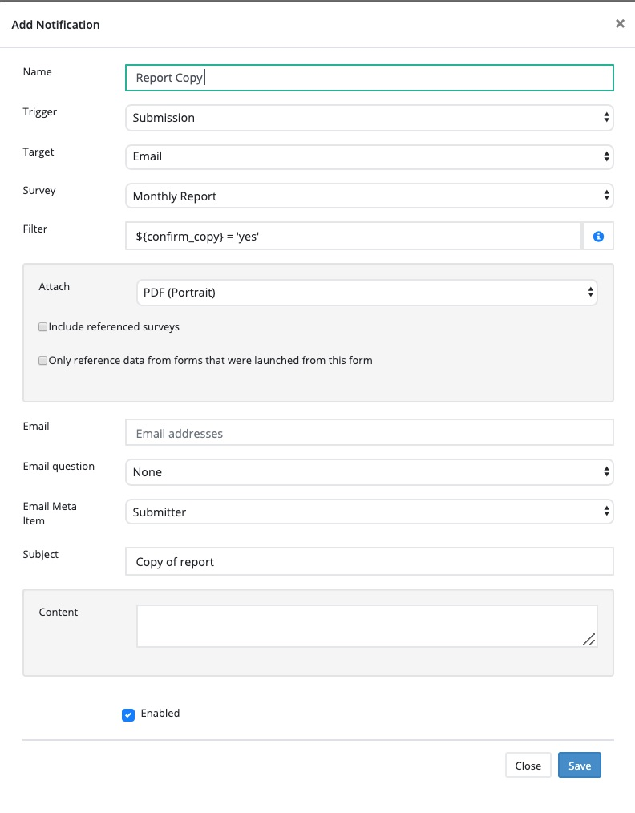

Provide copies of answers to email respondent
=============================================

.. contents::
 :local:

Situation
---------

If you send a mailout with a survey or you send an email task to a recipient then you may want the recipient to get a copy of the answers that they 
gave for their own records.

Solution
--------

Add to your survey a select multiple question with a single option: "Get a copy of the completed questionnaire".  

Create a notification for the survey 

#.  Set the trigger to "Submission"
#.  Set the target to "Email"
#.  Specify a filter: ${confirm_copy} = 'yes'
#.  Specify a PDF attachment
#.  In the Email Meta Item drop down select "Submitter".
#.  Optionally specify some text for the email subject or conten

So assuming that the name of the question that asks the user if they want a copy is "confirm_copy" and the value of the choice is "yes" then a copy of the 
answers should be sent to any respondent who selects that option.

