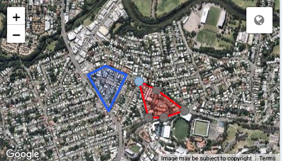
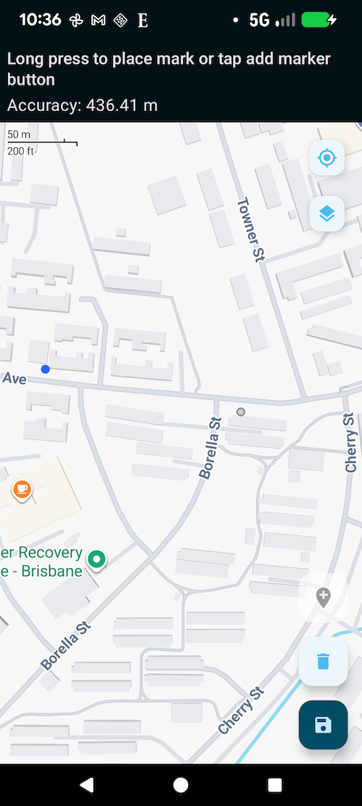

.. _reference_locations:

Refer to previously collected locations in a survey
===================================================

.. contents::
 :local:
 
Previously collected locations such as a geopoint, geoshape or geotrace can be referenced during a survey just like any other previously collected
data.  There several ways this can be done.

Locations in a repeat
---------------------

Add the appearance **history-map** to a location question inside a repeat.  For FieldTask you will also need to add an appearance of placement-map
so that the map is shown.

   Appearance history-map in WebForms on a geoshape question - one previous location shown in blue (Requires Smap Server 16.06+)

   Appearance history-map in FieldTask on a geopoint question - one previous location shown in blue

Get a previous recorded location using pulldata
-----------------------------------------------

The pulldata function can reference location data form a CSV file or another survey to use in a form. In this example the previously recorded
boundaries of a farm can be downloaded for editing.

.. csv-table:: Farm Boundaries Form
  :header: type, name, label, calculation

  text, name, Farm Name,
  geoshape, boundary, Record the boundary, "pulldata('linked_self', 'boundary', 'name', ${name})"
